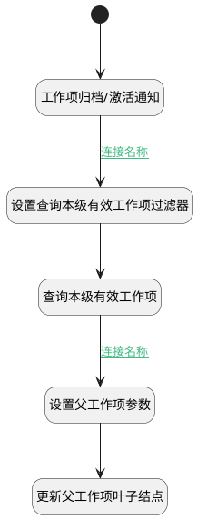

## 工作项归档变更附加逻辑 <!-- {docsify-ignore-all} -->

   工作项归档或激活时触发相应的通知消息，判断并标记上级是否为叶子节点

### 处理过程

### 处理步骤说明

#### 开始 :id=Begin [开始]

*- N/A*
#### 工作项归档/激活通知 :id=DENOTIFY1 [实体通知]

调用实体 [工作项(WORK_ITEM)](module/ProjMgmt/work_item.md) 通知 [工作项归档/激活通知(is_archived_notify)](module/ProjMgmt/work_item/notify/is_archived_notify) ，参数为`Default(传入变量)`
#### 设置查询本级有效工作项过滤器 :id=PREPAREPARAM2 [准备参数]

1. 将`Default(传入变量).PID(父标识)` 设置给  `work_item_filter.N_PID_EQ`

#### 查询本级有效工作项 :id=DEDATASET1 [实体数据集]

调用实体 [工作项(WORK_ITEM)](module/ProjMgmt/work_item.md) 数据集合 [正常状态(normal)](module/ProjMgmt/work_item#数据集合) ，查询参数为`work_item_filter`

将执行结果返回给参数`work_item_page`

#### 设置父工作项参数 :id=PREPAREPARAM1 [准备参数]

1. 将`Default(传入变量).PID(父标识)` 设置给  `p_work_item.ID(标识)`
2. 将`1` 设置给  `p_work_item.IS_LEAF(是否叶子节点)`

#### 更新父工作项叶子结点 :id=DEACTION1 [实体行为]

调用实体 [工作项(WORK_ITEM)](module/ProjMgmt/work_item.md) 行为 [Update](module/ProjMgmt/work_item#行为) ，行为参数为`p_work_item`

### 连接条件说明
#### 连接名称 :id=DENOTIFY1-PREPAREPARAM2

`Default(传入变量).PID(父标识)` ISNOTNULL
#### 连接名称 :id=DEDATASET1-PREPAREPARAM1

`work_item_page(work_item_page).size` EQ `0`

### 实体逻辑参数

|    中文名   |    代码名    |  数据类型    |  实体   |备注 |
| --------| --------| -------- | -------- | --------   |
|传入变量(<i class="fa fa-check"/></i>)|Default|数据对象|[工作项(WORK_ITEM)](module/ProjMgmt/work_item.md)||
|p_work_item|p_work_item|数据对象|[工作项(WORK_ITEM)](module/ProjMgmt/work_item.md)||
|work_item_filter|work_item_filter|过滤器|||
|work_item_page|work_item_page|分页查询|||
