## 工作项分布 <!-- {docsify-ignore-all} -->

   工作项分布数据源

### 处理过程

```plantuml
@startuml
hide empty description
<style>
root {
  HyperlinkColor #42b983
}
</style>

hide empty description
state "开始" as Begin <<start>> [[$./kanban_work_item_distribution#begin {"开始"}]]
state "结束" as END1 <<end>> [[$./kanban_work_item_distribution#end1 {"结束"}]]
state "查询工作项分布" as RAWSQLCALL1  [[$./kanban_work_item_distribution#rawsqlcall1 {"查询工作项分布"}]]


Begin --> RAWSQLCALL1
RAWSQLCALL1 --> END1


@enduml
```




### 处理步骤说明

#### 开始 :id=Begin<sup class="footnote-symbol"> <font color=gray size=1>[开始]</font></sup>


*- N/A*
#### 结束 :id=END1<sup class="footnote-symbol"> <font color=gray size=1>[结束]</font></sup>


返回 `result(结果)`

#### 查询工作项分布 :id=RAWSQLCALL1<sup class="footnote-symbol"> <font color=gray size=1>[直接SQL调用]</font></sup>


<p class="panel-title"><b>执行sql语句</b></p>

```sql
SELECT
  SUM(CASE WHEN s.`TYPE` != 'completed' THEN 1 ELSE 0 END) AS count2,
  SUM(CASE WHEN s.`TYPE` = 'completed' THEN 1 ELSE 0 END) AS count,
  wi.`ENTRY_ID` AS filter_type
FROM
  `WORK_ITEM` wi
  JOIN `WORK_ITEM_STATE` s ON wi.`STATE` = s.`ID`
WHERE
  wi.`PROJECT_ID` = ?
  AND wi.`IS_DELETED` = 0
  AND wi.`BOARD_ID` IS NOT NULL
  AND wi.`ENTRY_ID` IS NOT NULL
	AND ((? IS NULL OR ? = '') OR FIND_IN_SET(wi.BOARD_ID, ?))
	AND ((? IS NULL OR ? = '') OR FIND_IN_SET(wi.WORK_ITEM_TYPE_ID, ?))
GROUP BY
  wi.`ENTRY_ID`;
```

<p class="panel-title"><b>执行sql参数</b></p>

1. `Default(传入变量).n_project_id_eq`
2. `Default(传入变量).n_board_id_eq`
3. `Default(传入变量).n_board_id_eq`
4. `Default(传入变量).n_board_id_eq`
5. `Default(传入变量).n_work_item_type_id_eq`
6. `Default(传入变量).n_work_item_type_id_eq`
7. `Default(传入变量).n_work_item_type_id_eq`

重置参数`result(结果)`，并将执行sql结果赋值给参数`result(结果)`


### 实体逻辑参数

|    中文名   |    代码名    |  数据类型    |  实体   |备注 |
| --------| --------| -------- | -------- | --------   |
|传入变量(<i class="fa fa-check"/></i>)|Default|过滤器|||
|结果|result|数据对象列表|||
