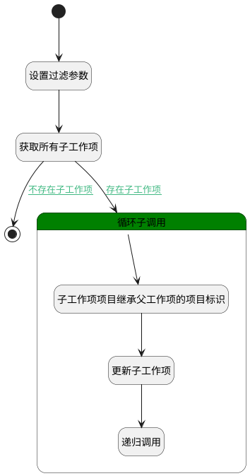

## 移动时子工作项的处理 <!-- {docsify-ignore-all} -->

   父工作项移动; 子工作项也移动;并对Top_id进行更新

### 处理过程

### 处理步骤说明

#### 开始 :id=Begin [开始]

*- N/A*
#### 设置过滤参数 :id=PREPAREPARAM1 [准备参数]

1. 将`Default(传入变量).ID(标识)` 设置给  `filter(工作项过滤器).n_pid_eq`

#### 获取所有子工作项 :id=DEDATASET1 [实体数据集]

调用实体 [工作项(WORK_ITEM)](module/ProjMgmt/work_item.md) 数据集合 [数据集(DEFAULT)](module/ProjMgmt/work_item#数据集合) ，查询参数为`filter(工作项过滤器)`

将执行结果返回给参数`child_page(子工作项查询结果)`

#### 循环子调用 :id=LOOPSUBCALL1 [循环子调用]

循环参数`child_page(子工作项查询结果)`，子循环参数使用`for_temp_obj(循环临时变量)`
#### 子工作项项目继承父工作项的项目标识 :id=PREPAREPARAM2 [准备参数]

1. 将`Default(传入变量).PROJECT_ID(项目)` 设置给  `for_temp_obj(循环临时变量).PROJECT_ID(项目)`
2. 将` ==> for_temp_obj[IDENTIFIER]` 设置给  `for_temp_obj(循环临时变量).IDENTIFIER(编号)`

#### 更新子工作项 :id=DEACTION1 [实体行为]

调用实体 [工作项(WORK_ITEM)](module/ProjMgmt/work_item.md) 行为 [Update](module/ProjMgmt/work_item#行为) ，行为参数为`for_temp_obj(循环临时变量)`

将执行结果返回给参数`for_temp_obj(循环临时变量)`

#### 递归调用 :id=DELOGIC1 [实体逻辑]

调用实体 [工作项(WORK_ITEM)](module/ProjMgmt/work_item.md) 处理逻辑 [移动时子工作项的处理]((module/ProjMgmt/work_item/logic/move_child_work_item.md)) ，行为参数为`for_temp_obj(循环临时变量)`

#### 结束 :id=END1 [结束]

*- N/A*

### 连接条件说明
#### 存在子工作项 :id=DEDATASET1-LOOPSUBCALL1

`child_page(子工作项查询结果).size` GT `0`
#### 不存在子工作项 :id=DEDATASET1-END1

`child_page(子工作项查询结果).size` EQ `0`

### 实体逻辑参数

|    中文名   |    代码名    |  数据类型    |  实体   |备注 |
| --------| --------| -------- | -------- | --------   |
|传入变量(<i class="fa fa-check"/></i>)|Default|数据对象|[工作项(WORK_ITEM)](module/ProjMgmt/work_item.md)||
|子工作项查询结果|child_page|分页查询|||
|工作项过滤器|filter|过滤器|||
|循环临时变量|for_temp_obj|数据对象|[工作项(WORK_ITEM)](module/ProjMgmt/work_item.md)||
