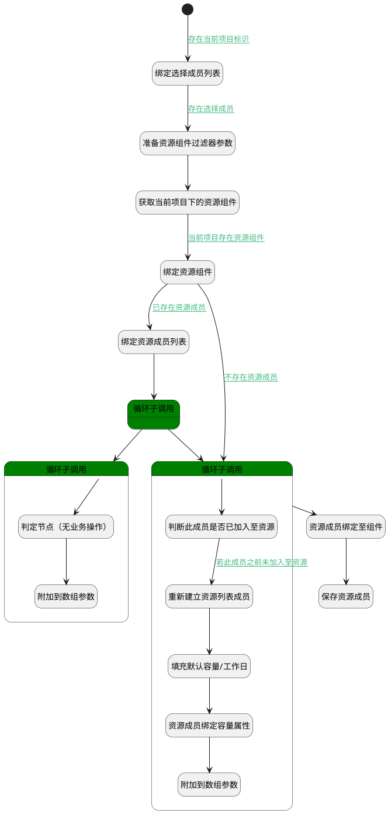

## 项目资源成员设置 <!-- {docsify-ignore-all} -->

   项目资源成员设置，默认设置容量/工作日

### 处理过程




### 处理步骤说明

#### 开始 :id=Begin<sup class="footnote-symbol"> <font color=gray size=1>[开始]</font></sup>


*- N/A*
#### 绑定选择成员列表 :id=BINDPARAM1<sup class="footnote-symbol"> <font color=gray size=1>[绑定参数]</font></sup>


绑定参数`Default(传入变量)` 到 `srfactionparam(选择成员列表)`
#### 准备资源组件过滤器参数 :id=PREPAREPARAM3<sup class="footnote-symbol"> <font color=gray size=1>[准备参数]</font></sup>


1. 将`Default(传入变量).PROJECT_ID(项目)` 设置给  `addon_resource_filter(资源组件过滤器).n_owner_id_eq`
2. 将`project` 设置给  `addon_resource_filter(资源组件过滤器).n_owner_type_eq`
3. 将`resource` 设置给  `addon_resource_filter(资源组件过滤器).n_addon_type_eq`

#### 获取当前项目下的资源组件 :id=DEDATASET1<sup class="footnote-symbol"> <font color=gray size=1>[实体数据集]</font></sup>


调用实体 [资源组件(ADDON_RESOURCE)](module/Base/addon_resource.md) 数据集合 [数据集(DEFAULT)](module/Base/addon_resource#数据集合) ，查询参数为`addon_resource_filter(资源组件过滤器)`

将执行结果返回给参数`addon_resource_page(资源组件分页查询结果变量)`

#### 绑定资源组件 :id=BINDPARAM3<sup class="footnote-symbol"> <font color=gray size=1>[绑定参数]</font></sup>


绑定参数`addon_resource_page(资源组件分页查询结果变量)` 到 `addon_resource(资源组件对象)`
#### 绑定资源成员列表 :id=BINDPARAM2<sup class="footnote-symbol"> <font color=gray size=1>[绑定参数]</font></sup>


绑定参数`addon_resource(资源组件对象)` 到 `resource_members(资源成员列表)`
#### 循环子调用 :id=LOOPSUBCALL2<sup class="footnote-symbol"> <font color=gray size=1>[循环子调用]</font></sup>


循环参数`resource_members(资源成员列表)`，子循环参数使用`for_temp_obj(成员循环临时变量)`
#### 循环子调用 :id=LOOPSUBCALL3<sup class="footnote-symbol"> <font color=gray size=1>[循环子调用]</font></sup>


循环参数`srfactionparam(选择成员列表)`，子循环参数使用`for_choose_obj(循环临时变量)`
#### 判定节点（无业务操作） :id=PREPAREPARAM4<sup class="footnote-symbol"> <font color=gray size=1>[准备参数]</font></sup>


    无

#### 附加到数组参数 :id=APPENDPARAM2<sup class="footnote-symbol"> <font color=gray size=1>[附加到数组参数]</font></sup>


将参数`for_temp_obj(成员循环临时变量)` 添加到数组参数`insert_members(保存资源列表成员)`
#### 循环子调用 :id=LOOPSUBCALL1<sup class="footnote-symbol"> <font color=gray size=1>[循环子调用]</font></sup>


循环参数`srfactionparam(选择成员列表)`，子循环参数使用`for_choose_obj(循环临时变量)`
#### 判断此成员是否已加入至资源 :id=RAWSFCODE4<sup class="footnote-symbol"> <font color=gray size=1>[直接后台代码]</font></sup>


<p class="panel-title"><b>执行代码[Groovy]</b></p>

```groovy
def insert_members = logic.param('insert_members').getReal()
def for_choose_obj = logic.param('for_choose_obj').getReal()
insert_members.each { item ->
    def user_id = item.user_id
    if(user_id == for_choose_obj.get('user_id')){
       for_choose_obj.set('already_exist', '1') 
    }
}


```

#### 重新建立资源列表成员 :id=RENEWPARAM1<sup class="footnote-symbol"> <font color=gray size=1>[重新建立参数]</font></sup>


重建参数```resource_member(资源成员对象)```
#### 填充默认容量/工作日 :id=PREPAREPARAM1<sup class="footnote-symbol"> <font color=gray size=1>[准备参数]</font></sup>


1. 将`for_choose_obj(循环临时变量).USER_ID(登录名)` 设置给  `resource_member(资源成员对象).ID(标识)`
2. 将`addon_resource(资源组件对象).ID(标识)` 设置给  `resource_member(资源成员对象).ADDON_ID(组件标识)`
3. 将`for_choose_obj(循环临时变量).NAME(名称)` 设置给  `resource_member(资源成员对象).NAME(姓名)`
4. 将`for_choose_obj(循环临时变量).USER_ID(登录名)` 设置给  `resource_member(资源成员对象).USER_ID(登录名)`
5. 将`1,2,3,4,5` 设置给  `resource_member(资源成员对象).WEEKDAY(周工作日)`
6. 将`for_choose_obj(循环临时变量).USER_ID(登录名)` 设置给  `day_capacity(容量对象).ID(标识)`
7. 将`3` 设置给  `day_capacity(容量对象).WORK_ITEM_COUNT(工作项数量)`
8. 将`8` 设置给  `day_capacity(容量对象).ESTIMATED_WORKLOAD(预估工时)`
9. 将`1` 设置给  `day_capacity(容量对象).REMAINING_WORKLOAD(剩余工时)`
10. 将`2` 设置给  `day_capacity(容量对象).STORY_POINTS(故事点)`

#### 资源成员绑定容量属性 :id=RAWSFCODE2<sup class="footnote-symbol"> <font color=gray size=1>[直接后台代码]</font></sup>


<p class="panel-title"><b>执行代码[Groovy]</b></p>

```groovy
def resource_member = logic.param('resource_member').getReal()
def day_capacity = logic.param('day_capacity').getReal()
resource_member.set('day_capacity', day_capacity)
```

#### 附加到数组参数 :id=APPENDPARAM1<sup class="footnote-symbol"> <font color=gray size=1>[附加到数组参数]</font></sup>


将参数`resource_member(资源成员对象)` 添加到数组参数`insert_members(保存资源列表成员)`
#### 资源成员绑定至组件 :id=RAWSFCODE3<sup class="footnote-symbol"> <font color=gray size=1>[直接后台代码]</font></sup>


<p class="panel-title"><b>执行代码[Groovy]</b></p>

```groovy
def insert_members = logic.param('insert_members').getReal()
def addon_resource = logic.param('addon_resource').getReal()
addon_resource.set('members', insert_members)
```

#### 保存资源成员 :id=DEACTION2<sup class="footnote-symbol"> <font color=gray size=1>[实体行为]</font></sup>


调用实体 [资源组件(ADDON_RESOURCE)](module/Base/addon_resource.md) 行为 [Update](module/Base/addon_resource#行为) ，行为参数为`addon_resource(资源组件对象)`

将执行结果返回给参数`addon_resource(资源组件对象)`


### 连接条件说明
#### 存在当前项目标识 :id=Begin-BINDPARAM1

`Default(传入变量).project_id(项目)` ISNOTNULL
#### 存在选择成员 :id=BINDPARAM1-PREPAREPARAM3

`srfactionparam(选择成员列表).size` GT `0`
#### 当前项目存在资源组件 :id=DEDATASET1-BINDPARAM3

`addon_resource_page(资源组件分页查询结果变量).size` GT `0`
#### 已存在资源成员 :id=BINDPARAM3-BINDPARAM2

`addon_resource(资源组件对象).MEMBERS(资源成员)` ISNOTNULL
#### 若成员已加入资源 


#### 若此成员之前未加入至资源 :id=RAWSFCODE4-RENEWPARAM1

`for_choose_obj(循环临时变量).already_exist` ISNULL
#### 不存在资源成员 :id=BINDPARAM3-LOOPSUBCALL1

`addon_resource(资源组件对象).MEMBERS(资源成员)` ISNULL


### 实体逻辑参数

|    中文名   |    代码名    |  数据类型    |  实体   |备注 |
| --------| --------| -------- | -------- | --------   |
|传入变量(<i class="fa fa-check"/></i>)|Default|数据对象|[工作项(WORK_ITEM)](module/ProjMgmt/work_item.md)||
|资源组件对象|addon_resource|数据对象|[资源组件(ADDON_RESOURCE)](module/Base/addon_resource.md)||
|资源组件过滤器|addon_resource_filter|过滤器|||
|资源组件分页查询结果变量|addon_resource_page|分页查询|||
|容量对象|day_capacity|数据对象|[日容量(DAY_CAPACITY)](module/ProjMgmt/day_capacity.md)||
|循环临时变量|for_choose_obj|数据对象|[成员(MEMBER)](module/Base/member.md)||
|成员循环临时变量|for_temp_obj|数据对象|[成员(MEMBER)](module/Base/member.md)||
|保存资源列表成员|insert_members|数据对象列表|[资源组件成员(RESOURCE_MEMBER)](module/Base/resource_member.md)||
|资源成员对象|resource_member|数据对象|[资源组件成员(RESOURCE_MEMBER)](module/Base/resource_member.md)||
|资源成员列表|resource_members|数据对象列表|[资源组件成员(RESOURCE_MEMBER)](module/Base/resource_member.md)||
|选择成员列表|srfactionparam|数据对象列表|[成员(MEMBER)](module/Base/member.md)||
