## 团队速度 <!-- {docsify-ignore-all} -->

   团队速度报表数据源

### 处理过程

```plantuml
@startuml
hide empty description
<style>
root {
  HyperlinkColor #42b983
}
</style>

hide empty description
state "开始" as Begin <<start>> [[$./project_team_speed#begin {"开始"}]]
state "结束" as END1 <<end>> [[$./project_team_speed#end1 {"结束"}]]
state "查询团队速度" as RAWSQLCALL1  [[$./project_team_speed#rawsqlcall1 {"查询团队速度"}]]


Begin --> RAWSQLCALL1
RAWSQLCALL1 --> END1


@enduml
```




### 处理步骤说明

#### 开始 :id=Begin<sup class="footnote-symbol"> <font color=gray size=1>[开始]</font></sup>


*- N/A*
#### 结束 :id=END1<sup class="footnote-symbol"> <font color=gray size=1>[结束]</font></sup>


返回 `result(结果)`

#### 查询团队速度 :id=RAWSQLCALL1<sup class="footnote-symbol"> <font color=gray size=1>[直接SQL调用]</font></sup>


<p class="panel-title"><b>执行sql语句</b></p>

```sql
SELECT
  SUM(CASE WHEN t31.`TYPE` = 'completed' THEN 1 ELSE 0 END) AS count2,
  COUNT(*) AS count,
  COALESCE(t1.`SPRINT_ID`, '未加入迭代') AS filter_type
FROM
  `WORK_ITEM` t1
  LEFT JOIN `WORK_ITEM_STATE` t31 ON t1.`STATE` = t31.`ID`
WHERE
  t1.`PROJECT_ID` = ?
--   AND t1.`WORK_ITEM_TYPE_ID` LIKE '%story%'
  AND t1.`IS_DELETED` = 0
	AND ((? IS NULL OR ? = '' OR ? IS NULL OR ? = '') OR t1.CREATE_TIME BETWEEN ? and ? )
GROUP BY
  filter_type;

```

<p class="panel-title"><b>执行sql参数</b></p>

1. `Default(传入变量).n_project_id_eq`
2. `Default(传入变量).n_create_time_gtandeq`
3. `Default(传入变量).n_create_time_gtandeq`
4. `Default(传入变量).n_create_time_ltandeq`
5. `Default(传入变量).n_create_time_ltandeq`
6. `Default(传入变量).n_create_time_gtandeq`
7. `Default(传入变量).n_create_time_ltandeq`

重置参数`result(结果)`，并将执行sql结果赋值给参数`result(结果)`


### 实体逻辑参数

|    中文名   |    代码名    |  数据类型    |  实体   |备注 |
| --------| --------| -------- | -------- | --------   |
|传入变量(<i class="fa fa-check"/></i>)|Default|过滤器|||
|结果|result|数据对象列表|||
