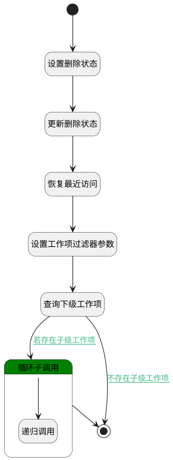

## 恢复 <!-- {docsify-ignore-all} -->

   递归所有下级工作项，恢复已删除状态工作项数据，修改工作项的是否删除属性值，并恢复访问记录

### 处理过程




### 处理步骤说明

#### 开始 :id=Begin<sup class="footnote-symbol"> <font color=gray size=1>[开始]</font></sup>


*- N/A*
#### 设置删除状态 :id=PREPAREPARAM2<sup class="footnote-symbol"> <font color=gray size=1>[准备参数]</font></sup>


1. 将`0` 设置给  `Default(传入变量).IS_DELETED(是否已删除)`

#### 更新删除状态 :id=DEACTION1<sup class="footnote-symbol"> <font color=gray size=1>[实体行为]</font></sup>


调用实体 [工作项(WORK_ITEM)](module/ProjMgmt/work_item.md) 行为 [Update](module/ProjMgmt/work_item#行为) ，行为参数为`Default(传入变量)`

#### 恢复最近访问 :id=RAWSQLCALL1<sup class="footnote-symbol"> <font color=gray size=1>[直接SQL调用]</font></sup>


<p class="panel-title"><b>执行sql语句</b></p>

```sql
update recent set IS_DELETED=0 where owner_id=? and owner_subtype='work_item'
```

<p class="panel-title"><b>执行sql参数</b></p>

1. `Default(传入变量).ID(标识)`


#### 设置工作项过滤器参数 :id=PREPAREPARAM1<sup class="footnote-symbol"> <font color=gray size=1>[准备参数]</font></sup>


1. 将`Default(传入变量).ID(标识)` 设置给  `work_item_filter(工作项查询过滤器).n_pid_eq`

#### 查询下级工作项 :id=DEDATASET1<sup class="footnote-symbol"> <font color=gray size=1>[实体数据集]</font></sup>


调用实体 [工作项(WORK_ITEM)](module/ProjMgmt/work_item.md) 数据集合 [数据集(DEFAULT)](module/ProjMgmt/work_item#数据集合) ，查询参数为`work_item_filter(工作项查询过滤器)`

将执行结果返回给参数`work_item_page(工作项分页结果对象)`

#### 循环子调用 :id=LOOPSUBCALL1<sup class="footnote-symbol"> <font color=gray size=1>[循环子调用]</font></sup>


循环参数`work_item_page(工作项分页结果对象)`，子循环参数使用`for_temp_obj(循环临时变量)`
#### 递归调用 :id=DELOGIC1<sup class="footnote-symbol"> <font color=gray size=1>[实体逻辑]</font></sup>


调用实体 [工作项(WORK_ITEM)](module/ProjMgmt/work_item.md) 处理逻辑 [恢复]((module/ProjMgmt/work_item/logic/recover.md)) ，行为参数为`for_temp_obj(循环临时变量)`

#### 结束 :id=END1<sup class="footnote-symbol"> <font color=gray size=1>[结束]</font></sup>


*- N/A*


### 连接条件说明
#### 若存在子级工作项 :id=DEDATASET1-LOOPSUBCALL1

`work_item_page(工作项分页结果对象).size` GT `0`
#### 不存在子级工作项 :id=DEDATASET1-END1

`work_item_page(工作项分页结果对象).size` EQ `0`


### 实体逻辑参数

|    中文名   |    代码名    |  数据类型    |  实体   |备注 |
| --------| --------| -------- | -------- | --------   |
|传入变量(<i class="fa fa-check"/></i>)|Default|数据对象|[工作项(WORK_ITEM)](module/ProjMgmt/work_item.md)||
|循环临时变量|for_temp_obj|数据对象|[工作项(WORK_ITEM)](module/ProjMgmt/work_item.md)||
|工作项查询过滤器|work_item_filter|过滤器|||
|工作项分页结果对象|work_item_page|分页查询|||
