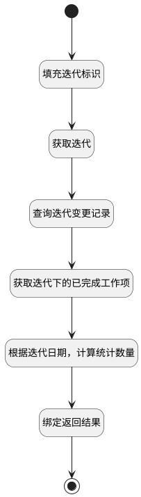

## 需求数量燃尽图 <!-- {docsify-ignore-all} -->

   需求数量燃尽图

### 处理过程




### 处理步骤说明

#### 开始 :id=BEGIN1<sup class="footnote-symbol"> <font color=gray size=1>[开始]</font></sup>


*- N/A*
#### 填充迭代标识 :id=PREPAREPARAM1<sup class="footnote-symbol"> <font color=gray size=1>[准备参数]</font></sup>


1. 将`Default(传入变量).sprint` 设置给  `sprint(迭代).ID(标识)`
2. 将`Default(传入变量).sprint` 设置给  `work_item_filter(工作项查询过滤器).n_sprint_id_eq`
3. 将`Default(传入变量).sprint` 设置给  `change_filter(迭代变更记录查询过滤器).n_sprint_id_eq`

#### 获取迭代 :id=DEACTION1<sup class="footnote-symbol"> <font color=gray size=1>[实体行为]</font></sup>


调用实体 [迭代(SPRINT)](module/ProjMgmt/sprint.md) 行为 [Get](module/ProjMgmt/sprint#行为) ，行为参数为`sprint(迭代)`

将执行结果返回给参数`sprint(迭代)`

#### 查询迭代变更记录 :id=DEDATASET1<sup class="footnote-symbol"> <font color=gray size=1>[实体数据集]</font></sup>


调用实体 [迭代变更(SPRINT_ALTERATION)](module/ProjMgmt/sprint_alteration.md) 数据集合 [工作项迭代变更记录(change)](module/ProjMgmt/sprint_alteration#数据集合) ，查询参数为`change_filter(迭代变更记录查询过滤器)`

将执行结果返回给参数`change_page(迭代变更记录)`

#### 获取迭代下的已完成工作项 :id=DEDATASET2<sup class="footnote-symbol"> <font color=gray size=1>[实体数据集]</font></sup>


调用实体 [工作项(WORK_ITEM)](module/ProjMgmt/work_item.md) 数据集合 [迭代下完成的工作项(sprint_completed)](module/ProjMgmt/work_item#数据集合) ，查询参数为`work_item_filter(工作项查询过滤器)`

将执行结果返回给参数`work_item_page(工作项查询结果变量)`

#### 根据迭代日期，计算统计数量 :id=RAWSFCODE2<sup class="footnote-symbol"> <font color=gray size=1>[直接后台代码]</font></sup>


<p class="panel-title"><b>执行代码[Groovy]</b></p>

```groovy
def change_page = logic.param('change_page').getReal()
def work_item_page = logic.param('work_item_page').getReal()
def sprint = logic.param('sprint').getReal()
def result_list = logic.param('result_list').getReal()


def startDate = new Date(sprint.get('start_at').time)
def endDate = new Date(sprint.get('end_at').time)

def dateFormatter = new java.text.SimpleDateFormat("yyyy-MM-dd")
def calendar = java.util.Calendar.getInstance()
calendar.time = startDate
// 从开始到结束的所有日期
while (!calendar.time.after(endDate)) {
    def rep_date = dateFormatter.format(calendar.time)
    def rep_obj = sys.entity('work_item')    
    rep_obj.set('rep_date', rep_date)
    result_list.add(rep_obj)
    calendar.add(java.util.Calendar.DATE, 1)
}

// 计算开始迭代时的移入工作项数量
def begin_count = 0
change_page.each { it ->
    // 迭代未开始 移入的记录
    if(it.get('type') == '1' && it.get('sprint_status') == '1'){
        begin_count++
    }
    if(it.get('type') == '2' && it.get('sprint_status') == '1' ){
        begin_count--
    }
}
def rep_num = begin_count
result_list.eachWithIndex { item, index ->
    def rep_date = dateFormatter.format(new Date(item.get('rep_date').time))
    if(begin_count > 0 && index != 0){
        // 计算递减步长
        def decrementStep = begin_count / (result_list.size() - 1)
        // 理想线 根据日期 从开始日期 逐天递减
        def rep_value1 =  begin_count - (decrementStep * index)        
        def formattedValue = String.format('%.2f', rep_value1)
        item.set('rep_value1', formattedValue)
    } else {
        item.set('rep_value1', 0)
    }
    if(index == 0){
        item.set('rep_value1', begin_count)
    }
    item.set('rep_value2', rep_num)
    work_item_page.each { it ->
        if(it.get('completed_at') != null){
            // 工作项完成时间
            def completed_at = dateFormatter.format(new Date(it.get('completed_at').time))
            if(completed_at == rep_date){
                rep_num--
                if(rep_num < 0){
                    rep_num = 0
                }
                item.set('rep_value2', rep_num)
            }  
        }    
    }
    change_page.each { it ->
        if(it.get('create_time') != null){
           // 移入移出迭代时间
            def change_date = dateFormatter.format(new Date(it.get('create_time').time))
            if(change_date == rep_date){
                // 迭代开始后 移入的记录
                if(it.get('type') == '1' && it.get('sprint_status') == '2'){
                    rep_num++
                    item.set('rep_value2', rep_num)
                }
                if(it.get('type') == '2' && it.get('sprint_status') == '2'){
                    rep_num--
                    if(rep_num < 0){
                        rep_num = 0
                    }
                    item.set('rep_value2', rep_num)
                }
            } 
        }
    }
}


```

#### 绑定返回结果 :id=BINDPARAM1<sup class="footnote-symbol"> <font color=gray size=1>[绑定参数]</font></sup>


绑定参数`result_list(燃尽图返回结果)` 到 `result_page(返回结果)`
#### 结束 :id=END1<sup class="footnote-symbol"> <font color=gray size=1>[结束]</font></sup>


返回 `result_page(返回结果)`


### 实体逻辑参数

|    中文名   |    代码名    |  数据类型    |  实体   |备注 |
| --------| --------| -------- | -------- | --------   |
|传入变量(<i class="fa fa-check"/></i>)|Default|过滤器|||
|迭代变更记录查询过滤器|change_filter|过滤器|||
|迭代变更记录|change_page|分页查询|||
|燃尽图返回结果|result_list|数据对象列表|[工作项(WORK_ITEM)](module/ProjMgmt/work_item.md)||
|返回结果|result_page|分页查询|||
|迭代|sprint|数据对象|[迭代(SPRINT)](module/ProjMgmt/sprint.md)||
|工作项查询过滤器|work_item_filter|过滤器|||
|工作项查询结果变量|work_item_page|分页查询|||
