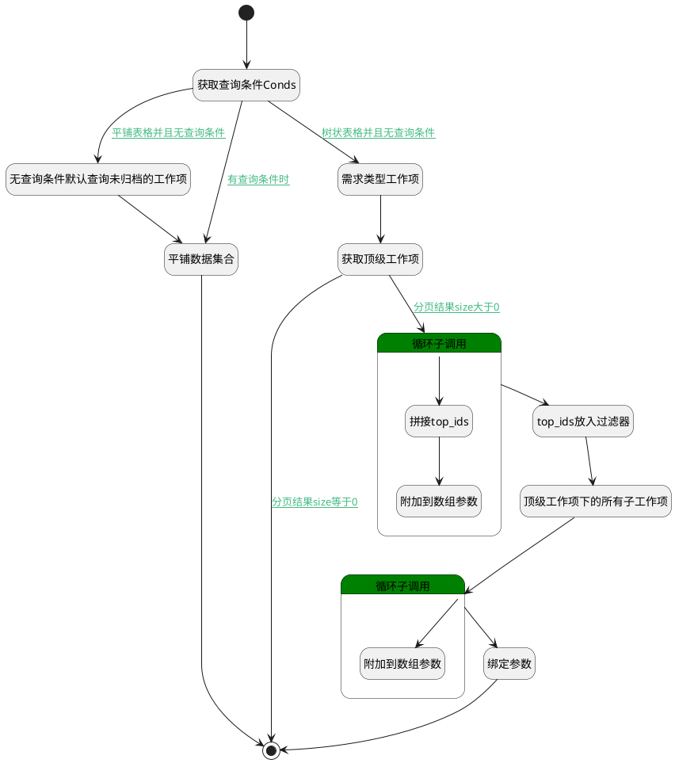

## 需求树表查询 <!-- {docsify-ignore-all} -->

   敏捷项目类型主视图下【需求】分页下使用

### 处理过程




### 处理步骤说明

#### 开始 :id=Begin<sup class="footnote-symbol"> <font color=gray size=1>[开始]</font></sup>


*- N/A*
#### 获取查询条件Conds :id=RAWSFCODE2<sup class="footnote-symbol"> <font color=gray size=1>[直接后台代码]</font></sup>


<p class="panel-title"><b>执行代码[Groovy]</b></p>

```groovy
def _default = logic.param('default').getReal()
logic.param('list_searchconds').bind(_default.getSearchConds())
```

#### 无查询条件默认查询未归档的工作项 :id=PREPAREPARAM4<sup class="footnote-symbol"> <font color=gray size=1>[准备参数]</font></sup>


1. 将`0` 设置给  `Default(传入变量).n_is_archived_eq`

#### 需求类型工作项 :id=PREPAREPARAM3<sup class="footnote-symbol"> <font color=gray size=1>[准备参数]</font></sup>


1. 将`requirement` 设置给  `Default(传入变量).n_work_item_type_group_eq`

#### 平铺数据集合 :id=DEDATASET2<sup class="footnote-symbol"> <font color=gray size=1>[实体数据集]</font></sup>


调用实体 [工作项(WORK_ITEM)](module/ProjMgmt/work_item.md) 数据集合 [需求工作项(requirement)](module/ProjMgmt/work_item#数据集合) ，查询参数为`Default(传入变量)`

将执行结果返回给参数`page(顶级工作项分页结果)`

#### 获取顶级工作项 :id=DEDATASET1<sup class="footnote-symbol"> <font color=gray size=1>[实体数据集]</font></sup>


调用实体 [工作项(WORK_ITEM)](module/ProjMgmt/work_item.md) 数据集合 [树表查询(top_tree_grid)](module/ProjMgmt/work_item#数据集合) ，查询参数为`Default(传入变量)`

将执行结果返回给参数`page(顶级工作项分页结果)`

#### 循环子调用 :id=LOOPSUBCALL1<sup class="footnote-symbol"> <font color=gray size=1>[循环子调用]</font></sup>


循环参数`page(顶级工作项分页结果)`，子循环参数使用`for_temp(循环临时变量)`
#### 拼接top_ids :id=RAWSFCODE1<sup class="footnote-symbol"> <font color=gray size=1>[直接后台代码]</font></sup>


<p class="panel-title"><b>执行代码[JavaScript]</b></p>

```javascript
var temp = logic.getParam("for_temp");
var work_item = logic.getParam("work_item");
var top_ids = work_item.get("top_ids");
if(top_ids == null){
    top_ids = temp.get("id");
} else {
    top_ids = top_ids + ";" + temp.get("id");
}
work_item.set("top_ids", top_ids);
```

#### 附加到数组参数 :id=APPENDPARAM1<sup class="footnote-symbol"> <font color=gray size=1>[附加到数组参数]</font></sup>


将参数`for_temp(循环临时变量)` 添加到数组参数`result_list(结果列表)`
#### top_ids放入过滤器 :id=PREPAREPARAM1<sup class="footnote-symbol"> <font color=gray size=1>[准备参数]</font></sup>


1. 将`work_item(承载ids属性).top_ids` 设置给  `child_filter(查询子工作项过滤器).n_top_id_in`
2. 将`1000` 设置给  `child_filter(查询子工作项过滤器).size`
3. 将`requirement` 设置给  `child_filter(查询子工作项过滤器).n_work_item_type_group_eq`

#### 顶级工作项下的所有子工作项 :id=DEDATASET3<sup class="footnote-symbol"> <font color=gray size=1>[实体数据集]</font></sup>


调用实体 [工作项(WORK_ITEM)](module/ProjMgmt/work_item.md) 数据集合 [正常状态(normal)](module/ProjMgmt/work_item#数据集合) ，查询参数为`child_filter(查询子工作项过滤器)`

将执行结果返回给参数`child_page(子工作项分页结果)`

#### 循环子调用 :id=LOOPSUBCALL2<sup class="footnote-symbol"> <font color=gray size=1>[循环子调用]</font></sup>


循环参数`child_page(子工作项分页结果)`，子循环参数使用`child_temp_obj(子工作项循环临时变量)`
#### 附加到数组参数 :id=APPENDPARAM2<sup class="footnote-symbol"> <font color=gray size=1>[附加到数组参数]</font></sup>


将参数`child_temp_obj(子工作项循环临时变量)` 添加到数组参数`result_list(结果列表)`
#### 绑定参数 :id=BINDPARAM1<sup class="footnote-symbol"> <font color=gray size=1>[绑定参数]</font></sup>


绑定参数`result_list(结果列表)` 到 `page(顶级工作项分页结果)`
#### 结束 :id=END1<sup class="footnote-symbol"> <font color=gray size=1>[结束]</font></sup>


返回 `page(顶级工作项分页结果)`


### 连接条件说明
#### 平铺表格并且无查询条件 :id=RAWSFCODE2-PREPAREPARAM4

`Default(传入变量).srfshowmode` ISNULL AND `list_searchconds(list_searchconds).size` EQ `1`
#### 树状表格并且无查询条件 :id=RAWSFCODE2-PREPAREPARAM3

`list_searchconds(list_searchconds).size` EQ `1` AND `Default(传入变量).srfshowmode` EQ `tree`
#### 分页结果size大于0 :id=DEDATASET1-LOOPSUBCALL1

`page(顶级工作项分页结果).size` GT `0`
#### 分页结果size等于0 :id=DEDATASET1-END1

`page(顶级工作项分页结果).size` EQ `0`
#### 有查询条件时 :id=RAWSFCODE2-DEDATASET2

`list_searchconds(list_searchconds).size` GT `1`


### 实体逻辑参数

|    中文名   |    代码名    |  数据类型    |  实体   |备注 |
| --------| --------| -------- | -------- | --------   |
|传入变量(<i class="fa fa-check"/></i>)|Default|过滤器|||
|查询子工作项过滤器|child_filter|过滤器|||
|子工作项分页结果|child_page|分页查询|||
|子工作项循环临时变量|child_temp_obj|数据对象|[工作项(WORK_ITEM)](module/ProjMgmt/work_item.md)||
|循环临时变量|for_temp|数据对象|[工作项(WORK_ITEM)](module/ProjMgmt/work_item.md)||
|list_searchconds|list_searchconds|数据对象列表|[人员(SYS_EMP)](module/ebsx/SysEmployee.md)|默认会携带上下文中的project_id条件。size默认=1；携带搜索栏中条件时或快速搜索时size>1|
|顶级工作项分页结果|page|分页查询|||
|顶级工作项的总条数|page_total|简单数据|||
|结果列表|result_list|数据对象列表|[工作项(WORK_ITEM)](module/ProjMgmt/work_item.md)||
|承载ids属性|work_item|数据对象|[工作项(WORK_ITEM)](module/ProjMgmt/work_item.md)||
