## 需求树状或平铺表格查询 <!-- {docsify-ignore-all} -->

   需求树状或平铺表格查询

### 处理过程

```plantuml
@startuml
hide empty description
<style>
root {
  HyperlinkColor #42b983
}
</style>

hide empty description
state "开始" as Begin <<start>> [[$./requirement_tree_or_tile_query#begin {"开始"}]]
state "平铺表格查询" as DEDATASET1  [[$./requirement_tree_or_tile_query#dedataset1 {"平铺表格查询"}]]
state "树状表格查询" as DEDATASET2  [[$./requirement_tree_or_tile_query#dedataset2 {"树状表格查询"}]]
state "结束" as END1 <<end>> [[$./requirement_tree_or_tile_query#end1 {"结束"}]]


Begin --> DEDATASET1 : [[$./requirement_tree_or_tile_query#begin-dedataset1{srfshowmode为空} srfshowmode为空]]
DEDATASET1 --> END1
Begin --> DEDATASET2 : [[$./requirement_tree_or_tile_query#begin-dedataset2{srfshowmode=tree} srfshowmode=tree]]
DEDATASET2 --> END1


@enduml
```

### 处理步骤说明

#### 开始 :id=Begin [开始]

*- N/A*
#### 平铺表格查询 :id=DEDATASET1 [实体数据集]

调用实体 [工作项(WORK_ITEM)](module/ProjMgmt/work_item.md) 数据集合 [需求工作项(requirement)](module/ProjMgmt/work_item#数据集合) ，查询参数为`Default(传入变量)`

将执行结果返回给参数`result_page(分页查询结果变量)`

#### 树状表格查询 :id=DEDATASET2 [实体数据集]

调用实体 [工作项(WORK_ITEM)](module/ProjMgmt/work_item.md) 数据集合 [需求树表查询(requirement_tree)](module/ProjMgmt/work_item#数据集合) ，查询参数为`Default(传入变量)`

将执行结果返回给参数`result_page(分页查询结果变量)`

#### 结束 :id=END1 [结束]

返回 `result_page(分页查询结果变量)`

### 连接条件说明
#### srfshowmode为空 :id=Begin-DEDATASET1

`Default(传入变量).srfshowmode` ISNULL
#### srfshowmode=tree :id=Begin-DEDATASET2

`Default(传入变量).srfshowmode` EQ `tree`

### 实体逻辑参数

|    中文名   |    代码名    |  数据类型    |  实体   |备注 |
| --------| --------| -------- | -------- | --------   |
|传入变量(<i class="fa fa-check"/></i>)|Default|过滤器|||
|分页查询结果变量|result_page|分页查询|||
