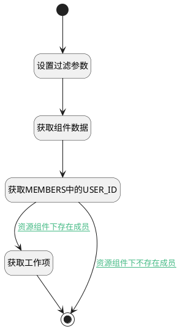

## 资源分配 <!-- {docsify-ignore-all} -->

   资源分配下的工作项

### 处理过程




### 处理步骤说明

#### 开始 :id=Begin<sup class="footnote-symbol"> <font color=gray size=1>[开始]</font></sup>


*- N/A*
#### 设置过滤参数 :id=PREPAREPARAM1<sup class="footnote-symbol"> <font color=gray size=1>[准备参数]</font></sup>


1. 将`42e3898e-d43b-3f3c-611b-87b5e6ed2233_resource` 设置给  `addon_resource(资源组件对象).ID(标识)`
2. 将`10000` 设置给  `Default(传入变量).size`

#### 获取组件数据 :id=DEACTION1<sup class="footnote-symbol"> <font color=gray size=1>[实体行为]</font></sup>


调用实体 [资源组件(ADDON_RESOURCE)](module/Base/addon_resource.md) 行为 [Get](module/Base/addon_resource#行为) ，行为参数为`addon_resource(资源组件对象)`

将执行结果返回给参数`addon_resource(资源组件对象)`

#### 获取工作项 :id=DEDATASET1<sup class="footnote-symbol"> <font color=gray size=1>[实体数据集]</font></sup>


调用实体 [工作项(WORK_ITEM)](module/ProjMgmt/work_item.md) 数据集合 [正常状态(normal)](module/ProjMgmt/work_item#数据集合) ，查询参数为`Default(传入变量)`

将执行结果返回给参数`work_item_page(工作项)`

#### 获取MEMBERS中的USER_ID :id=RAWSFCODE1<sup class="footnote-symbol"> <font color=gray size=1>[直接后台代码]</font></sup>


<p class="panel-title"><b>执行代码[Groovy]</b></p>

```groovy
def addon_resource = logic.param('addon_resource').getReal()
// 获取查询过滤器对象
def filter = logic.param('default').getReal()
def setting_model = addon_resource.get('setting_model')
if(!setting_model.isEmpty()){
    // JSON字符串转换
    def json = new groovy.json.JsonSlurper().parseText(setting_model)
    // 获取members属性
    def members = json.members
    // 循环members，将user_id拼至过滤器的n_assignee_id_in过滤项中
    members.each { item ->
        def user_id = item.user_id
        if(!user_id.isEmpty()){
            def assignee_ids = filter.get('n_assignee_id_in')
            if(assignee_ids.isEmpty()){
                filter.set('n_assignee_id_in', user_id)
            } else {
                filter.set('n_assignee_id_in', assignee_ids + ',' + user_id)
            }
        }
    }
}

```

#### 结束 :id=END1<sup class="footnote-symbol"> <font color=gray size=1>[结束]</font></sup>


返回 `work_item_page(工作项)`


### 连接条件说明
#### 资源组件下存在成员 :id=RAWSFCODE1-DEDATASET1

`Default(传入变量).n_assignee_id_eq` ISNOTNULL
#### 资源组件下不存在成员 :id=RAWSFCODE1-END1

`Default(传入变量).n_assignee_id_in` ISNULL


### 实体逻辑参数

|    中文名   |    代码名    |  数据类型    |  实体   |备注 |
| --------| --------| -------- | -------- | --------   |
|传入变量(<i class="fa fa-check"/></i>)|Default|过滤器|||
|资源组件对象|addon_resource|数据对象|[资源组件(ADDON_RESOURCE)](module/Base/addon_resource.md)||
|工作项|work_item_page|分页查询|||
