## 恢复历史版本 <!-- {docsify-ignore-all} -->

   恢复工作项版本至某一指定历史版本

### 处理过程

```plantuml
@startuml
hide empty description
<style>
root {
  HyperlinkColor #42b983
}
</style>

hide empty description
state "开始" as Begin <<start>> [[$./restore_version#begin {"开始"}]]
state "提取版本" as PREPAREPARAM  [[$./restore_version#prepareparam {"提取版本"}]]
state "恢复版本" as DEACTION  [[$./restore_version#deaction {"恢复版本"}]]
state "结束" as END1 <<end>> [[$./restore_version#end1 {"结束"}]]


Begin --> PREPAREPARAM
PREPAREPARAM --> DEACTION
DEACTION --> END1


@enduml
```

### 处理步骤说明

#### 开始 :id=Begin [开始]

*- N/A*
#### 提取版本 :id=PREPAREPARAM [准备参数]

1. 将`Default(传入变量).srfversionid` 设置给  `version(版本).ID(标识)`
2. 将`WORK_ITEM` 设置给  `version(版本).OWNER_TYPE(所属数据对象)`
3. 将`Default(传入变量).ID(标识)` 设置给  `version(版本).OWNER_ID(所属数据标识)`

#### 恢复版本 :id=DEACTION [实体行为]

调用实体 [版本(VERSION)](module/Base/version.md) 行为 [恢复指定版本(RESTORE)](module/Base/version#行为) ，行为参数为`version(版本)`

#### 结束 :id=END1 [结束]

返回 `Default(传入变量)`

### 实体逻辑参数

|    中文名   |    代码名    |  数据类型    |  实体   |备注 |
| --------| --------| -------- | -------- | --------   |
|传入变量(<i class="fa fa-check"/></i>)|Default|数据对象|[工作项(WORK_ITEM)](module/ProjMgmt/work_item.md)||
|版本|version|数据对象|[版本(VERSION)](module/Base/version.md)||
