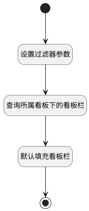

## 设置默认看板栏 <!-- {docsify-ignore-all} -->

   选择看板后，自动填充所属看板下的的首个看板栏

### 处理过程




### 处理步骤说明

#### 开始 :id=Begin<sup class="footnote-symbol"> <font color=gray size=1>[开始]</font></sup>


*- N/A*
#### 设置过滤器参数 :id=PREPAREPARAM1<sup class="footnote-symbol"> <font color=gray size=1>[准备参数]</font></sup>


1. 将`Default(传入变量).BOARD_ID(看板标识)` 设置给  `entry_filter(看板栏过滤器).n_board_id_eq`
2. 将`showorder,asc` 设置给  `entry_filter(看板栏过滤器).sort`

#### 查询所属看板下的看板栏 :id=DEDATASET1<sup class="footnote-symbol"> <font color=gray size=1>[实体数据集]</font></sup>


调用实体 [看板栏(ENTRY)](module/ProjMgmt/entry.md) 数据集合 [数据集(DEFAULT)](module/ProjMgmt/entry#数据集合) ，查询参数为`entry_filter(看板栏过滤器)`

将执行结果返回给参数`entry_page(看板栏分页结果对象)`

#### 默认填充看板栏 :id=RAWSFCODE1<sup class="footnote-symbol"> <font color=gray size=1>[直接后台代码]</font></sup>


<p class="panel-title"><b>执行代码[JavaScript]</b></p>

```javascript
var defaultObj = logic.getParam("Default");
var entry_page = logic.getParam("entry_page");
if(entry_page.getReal().numberOfElements > 0){
    defaultObj.set("entry_id", entry_page.get(0).get("id"));
}
```

#### 结束 :id=END1<sup class="footnote-symbol"> <font color=gray size=1>[结束]</font></sup>


返回 `Default(传入变量)`


### 实体逻辑参数

|    中文名   |    代码名    |  数据类型    |  实体   |备注 |
| --------| --------| -------- | -------- | --------   |
|传入变量(<i class="fa fa-check"/></i>)|Default|数据对象|[工作项(WORK_ITEM)](module/ProjMgmt/work_item.md)||
|看板栏过滤器|entry_filter|过滤器|||
|看板栏分页结果对象|entry_page|分页查询|||
