## 设置初始排序值 <!-- {docsify-ignore-all} -->

   设置初始排序值

### 处理过程

```plantuml
@startuml
hide empty description
<style>
root {
  HyperlinkColor #42b983
}
</style>

hide empty description
state "开始" as Begin <<start>> [[$./set_sequence#begin {"开始"}]]
state "设置初始排序值" as PREPAREPARAM1  [[$./set_sequence#prepareparam1 {"设置初始排序值"}]]
state "处理初始排序值" as RAWSFCODE1  [[$./set_sequence#rawsfcode1 {"处理初始排序值"}]]
state "结束" as END1 <<end>> [[$./set_sequence#end1 {"结束"}]]


Begin --> PREPAREPARAM1
PREPAREPARAM1 --> RAWSFCODE1
RAWSFCODE1 --> END1


@enduml
```




### 处理步骤说明

#### 开始 :id=Begin<sup class="footnote-symbol"> <font color=gray size=1>[开始]</font></sup>


*- N/A*
#### 设置初始排序值 :id=PREPAREPARAM1<sup class="footnote-symbol"> <font color=gray size=1>[准备参数]</font></sup>


1. 将`Default(传入变量).IDENTIFIER(编号)` 设置给  `Default(传入变量).SEQUENCE(序号)`

#### 处理初始排序值 :id=RAWSFCODE1<sup class="footnote-symbol"> <font color=gray size=1>[直接后台代码]</font></sup>


<p class="panel-title"><b>执行代码[Groovy]</b></p>

```groovy
def _default = logic.param('Default').getReal() 
def _sequence = _default.get('sequence')
_default.set('sequence', _sequence*100)
```

#### 结束 :id=END1<sup class="footnote-symbol"> <font color=gray size=1>[结束]</font></sup>


返回 `Default(传入变量)`


### 实体逻辑参数

|    中文名   |    代码名    |  数据类型    |  实体   |备注 |
| --------| --------| -------- | -------- | --------   |
|传入变量(<i class="fa fa-check"/></i>)|Default|数据对象|[工作项(WORK_ITEM)](module/ProjMgmt/work_item.md)||
