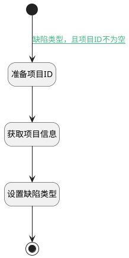

## 设置缺陷类型 <!-- {docsify-ignore-all} -->

   设置当前工作项为缺陷类型

### 处理过程




### 处理步骤说明

#### 开始 :id=Begin<sup class="footnote-symbol"> <font color=gray size=1>[开始]</font></sup>


*- N/A*
#### 准备项目ID :id=PREPAREPARAM1<sup class="footnote-symbol"> <font color=gray size=1>[准备参数]</font></sup>


1. 将`Default(传入变量).PROJECT_ID(项目)` 设置给  `project.ID(标识)`

#### 获取项目信息 :id=DEACTION1<sup class="footnote-symbol"> <font color=gray size=1>[实体行为]</font></sup>


调用实体 [项目(PROJECT)](module/ProjMgmt/project.md) 行为 [Get](module/ProjMgmt/project#行为) ，行为参数为`project`

将执行结果返回给参数`project`

#### 设置缺陷类型 :id=RAWSFCODE1<sup class="footnote-symbol"> <font color=gray size=1>[直接后台代码]</font></sup>


<p class="panel-title"><b>执行代码[JavaScript]</b></p>

```javascript
var Default = logic.getParam("Default");
var project = logic.getParam("project");
Default.set("work_item_type_id", project.get("type") + "_bug");
Default.set("work_item_type_name", "缺陷");

```

#### 结束 :id=END1<sup class="footnote-symbol"> <font color=gray size=1>[结束]</font></sup>


返回 `Default(传入变量)`


### 连接条件说明
#### 缺陷类型，且项目ID不为空 :id=Begin-PREPAREPARAM1

`Default(传入变量).work_item_type_group_bug` EQ `bug` AND `Default(传入变量).PROJECT_ID(项目)` ISNOTNULL


### 实体逻辑参数

|    中文名   |    代码名    |  数据类型    |  实体   |备注 |
| --------| --------| -------- | -------- | --------   |
|传入变量(<i class="fa fa-check"/></i>)|Default|数据对象|[工作项(WORK_ITEM)](module/ProjMgmt/work_item.md)||
|project|project|数据对象|[项目(PROJECT)](module/ProjMgmt/project.md)||
