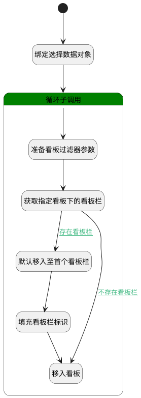

## 移入看板 <!-- {docsify-ignore-all} -->

   将工作项移入对应看板

### 处理过程

### 处理步骤说明

#### 开始 :id=Begin [开始]

*- N/A*
#### 绑定选择数据对象 :id=BINDPARAM1 [绑定参数]

绑定参数`Default(传入变量)` 到 `srfactionparam(选择数据对象)`
#### 默认移入至首个看板栏 :id=BINDPARAM2 [绑定参数]

绑定参数`entry_page(看板栏查询结果)` 到 `entry(看板栏)`
#### 填充看板栏标识 :id=PREPAREPARAM3 [准备参数]

1. 将`entry(看板栏).ID(标识)` 设置给  `Default(传入变量).ENTRY_ID(看板栏标识)`

#### 循环子调用 :id=LOOPSUBCALL1 [循环子调用]

循环参数`srfactionparam(选择数据对象)`，子循环参数使用`for_temp_obj(循环临时变量)`
#### 准备看板过滤器参数 :id=PREPAREPARAM2 [准备参数]

1. 将`for_temp_obj(循环临时变量).target_board_id` 设置给  `Default(传入变量).BOARD_ID(看板标识)`
2. 将`showorder,asc` 设置给  `entry_filter(看板栏过滤器).sort`
3. 将`for_temp_obj(循环临时变量).target_board_id` 设置给  `entry_filter(看板栏过滤器).n_board_id_eq`

#### 获取指定看板下的看板栏 :id=DEDATASET1 [实体数据集]

调用实体 [看板栏(ENTRY)](module/ProjMgmt/entry.md) 数据集合 [数据集(DEFAULT)](module/ProjMgmt/entry#数据集合) ，查询参数为`entry_filter(看板栏过滤器)`

将执行结果返回给参数`entry_page(看板栏查询结果)`

#### 移入看板 :id=DEACTION1 [实体行为]

调用实体 [工作项(WORK_ITEM)](module/ProjMgmt/work_item.md) 行为 [Update](module/ProjMgmt/work_item#行为) ，行为参数为`Default(传入变量)`

### 连接条件说明
#### 存在看板栏 :id=DEDATASET1-BINDPARAM2

`entry_page(看板栏查询结果).size` GT `0`
#### 不存在看板栏 :id=DEDATASET1-DEACTION1

`entry_page(看板栏查询结果).size` EQ `0`

### 实体逻辑参数

|    中文名   |    代码名    |  数据类型    |  实体   |备注 |
| --------| --------| -------- | -------- | --------   |
|传入变量(<i class="fa fa-check"/></i>)|Default|数据对象|[工作项(WORK_ITEM)](module/ProjMgmt/work_item.md)||
|看板栏|entry|数据对象|[看板栏(ENTRY)](module/ProjMgmt/entry.md)||
|看板栏过滤器|entry_filter|过滤器|||
|看板栏查询结果|entry_page|分页查询|||
|循环临时变量|for_temp_obj|数据对象|[工作项(WORK_ITEM)](module/ProjMgmt/work_item.md)||
|选择数据对象|srfactionparam|数据对象列表|[工作项(WORK_ITEM)](module/ProjMgmt/work_item.md)||
