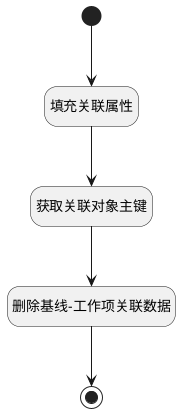

## 移出基线 <!-- {docsify-ignore-all} -->

   将工作项移出对应基线

### 处理过程




### 处理步骤说明

#### 开始 :id=Begin<sup class="footnote-symbol"> <font color=gray size=1>[开始]</font></sup>


*- N/A*
#### 填充关联属性 :id=PREPAREPARAM1<sup class="footnote-symbol"> <font color=gray size=1>[准备参数]</font></sup>


1. 将`Default(传入变量).baseline_id` 设置给  `relation(关联对象).PRINCIPAL_ID(关联主体标识)`
2. 将`Default(传入变量).ID(标识)` 设置给  `relation(关联对象).TARGET_ID(关联目标标识)`
3. 将`work_item` 设置给  `relation(关联对象).TARGET_TYPE(关联目标类型)`
4. 将`baseline` 设置给  `relation(关联对象).PRINCIPAL_TYPE(关联主体类型)`

#### 获取关联对象主键 :id=RAWSFCODE1<sup class="footnote-symbol"> <font color=gray size=1>[直接后台代码]</font></sup>


<p class="panel-title"><b>执行代码[JavaScript]</b></p>

```javascript
var relation = logic.getParam("relation");
if(relation.get("principal_id") != null && relation.get("target_id") != null){
    relation.set("id", relation.get("principal_id") + "_" + relation.get("target_id"));
}
```

#### 删除基线-工作项关联数据 :id=DEACTION1<sup class="footnote-symbol"> <font color=gray size=1>[实体行为]</font></sup>


调用实体 [关联(RELATION)](module/Base/relation.md) 行为 [Remove](module/Base/relation#行为) ，行为参数为`relation(关联对象)`

#### 结束 :id=END1<sup class="footnote-symbol"> <font color=gray size=1>[结束]</font></sup>


*- N/A*


### 实体逻辑参数

|    中文名   |    代码名    |  数据类型    |  实体   |备注 |
| --------| --------| -------- | -------- | --------   |
|传入变量(<i class="fa fa-check"/></i>)|Default|数据对象|[工作项(WORK_ITEM)](module/ProjMgmt/work_item.md)||
|关联对象|relation|数据对象|[关联(RELATION)](module/Base/relation.md)||
