## 移出迭代 <!-- {docsify-ignore-all} -->

   工作项移出迭代

### 处理过程

```plantuml
@startuml
hide empty description
<style>
root {
  HyperlinkColor #42b983
}
</style>

hide empty description
state "开始" as Begin <<start>> [[$./shift_out_sprint#begin {"开始"}]]
state "置空迭代标识" as PREPAREPARAM1  [[$./shift_out_sprint#prepareparam1 {"置空迭代标识"}]]
state "更新工作项" as DEACTION1  [[$./shift_out_sprint#deaction1 {"更新工作项"}]]
state "结束" as END1 <<end>> [[$./shift_out_sprint#end1 {"结束"}]]


Begin --> PREPAREPARAM1
PREPAREPARAM1 --> DEACTION1
DEACTION1 --> END1


@enduml
```

### 处理步骤说明

#### 开始 :id=Begin [开始]

*- N/A*
#### 置空迭代标识 :id=PREPAREPARAM1 [准备参数]

1. 将`Default(传入变量).ID(标识)` 设置给  `update_obj(工作项更新对象).ID(标识)`
2. 将`空值（NULL）` 设置给  `update_obj(工作项更新对象).SPRINT_ID(迭代标识)`

#### 更新工作项 :id=DEACTION1 [实体行为]

调用实体 [工作项(WORK_ITEM)](module/ProjMgmt/work_item.md) 行为 [Update](module/ProjMgmt/work_item#行为) ，行为参数为`update_obj(工作项更新对象)`

将执行结果返回给参数`update_obj(工作项更新对象)`

#### 结束 :id=END1 [结束]

*- N/A*

### 实体逻辑参数

|    中文名   |    代码名    |  数据类型    |  实体   |备注 |
| --------| --------| -------- | -------- | --------   |
|传入变量(<i class="fa fa-check"/></i>)|Default|数据对象|[工作项(WORK_ITEM)](module/ProjMgmt/work_item.md)||
|工作项更新对象|update_obj|数据对象|[工作项(WORK_ITEM)](module/ProjMgmt/work_item.md)||
