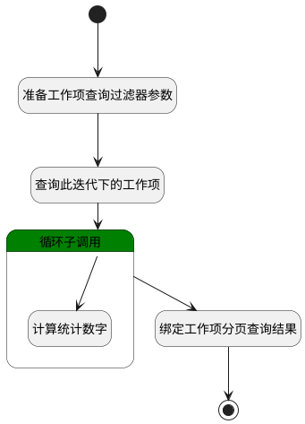

## 迭代成员贡献度 <!-- {docsify-ignore-all} -->

   迭代成员贡献度

### 处理过程




### 处理步骤说明

#### 开始 :id=Begin<sup class="footnote-symbol"> <font color=gray size=1>[开始]</font></sup>


*- N/A*
#### 准备工作项查询过滤器参数 :id=PREPAREPARAM1<sup class="footnote-symbol"> <font color=gray size=1>[准备参数]</font></sup>


1. 将`10000` 设置给  `Default(传入变量).size`
2. 将`Default(传入变量).project` 设置给  `Default(传入变量).n_project_id_eq`
3. 将`Default(传入变量).sprint` 设置给  `Default(传入变量).n_sprint_id_eq`
4. 将`0` 设置给  `Default(传入变量).n_is_deleted_eq`

#### 查询此迭代下的工作项 :id=DEDATASET1<sup class="footnote-symbol"> <font color=gray size=1>[实体数据集]</font></sup>


调用实体 [工作项(WORK_ITEM)](module/ProjMgmt/work_item.md) 数据集合 [数据集(DEFAULT)](module/ProjMgmt/work_item#数据集合) ，查询参数为`Default(传入变量)`

将执行结果返回给参数`work_item_page(工作项分页查询结果对象)`

#### 循环子调用 :id=LOOPSUBCALL1<sup class="footnote-symbol"> <font color=gray size=1>[循环子调用]</font></sup>


循环参数`work_item_page(工作项分页查询结果对象)`，子循环参数使用`for_obj(循环变量)`
#### 计算统计数字 :id=RAWSFCODE1<sup class="footnote-symbol"> <font color=gray size=1>[直接后台代码]</font></sup>


<p class="panel-title"><b>执行代码[Groovy]</b></p>

```groovy
def for_obj = logic.param('for_obj').getReal()
// 工作项类型统计
def work_item_type = for_obj.get('work_item_type_id')
// scrum_story scrum_task scrum_bug 用户故事/任务/缺陷 使用rep_value统计字段
for_obj.set('rep_value1', 0)
for_obj.set('rep_value2', 0)
for_obj.set('rep_value3', 0)
if(work_item_type == 'scrum_story'){
    for_obj.set('rep_value1', 1)
}
if(work_item_type == 'scrum_task'){
    for_obj.set('rep_value2', 1)
}
if(work_item_type == 'scrum_bug'){
    for_obj.set('rep_value3', 1)
}
// 工作项工时统计
if(for_obj.get('estimated_workload') == null ){
    for_obj.set('estimated_workload', 0)
}
if(for_obj.get('actual_workload') == null ){
    for_obj.set('actual_workload', 0)
}
// 统计结果列表变量
def result_list = logic.param('result_list').getReal()
def assignee_id = for_obj.get('assignee_id')
if(assignee_id != null){
    def exists = result_list.any { it.assignee_id == assignee_id }
    if(exists){
        result_list.each { item ->
            if(item.get('assignee_id') == assignee_id){
                item.set('rep_num', item.get('rep_num') + for_obj.get('rep_num'))
                item.set('estimated_workload', item.get('estimated_workload') + for_obj.get('estimated_workload'))
                item.set('actual_workload', item.get('actual_workload') + for_obj.get('actual_workload'))
                item.set('rep_value1', item.get('rep_value1') + for_obj.get('rep_value1'))
                item.set('rep_value2', item.get('rep_value2') + for_obj.get('rep_value2'))
                item.set('rep_value3', item.get('rep_value3') + for_obj.get('rep_value3'))
            }
        }
    } else {
        result_list.add(for_obj)
    }
}
```

#### 绑定工作项分页查询结果 :id=BINDPARAM1<sup class="footnote-symbol"> <font color=gray size=1>[绑定参数]</font></sup>


绑定参数`result_list(结果列表)` 到 `work_item_page(工作项分页查询结果对象)`
#### 结束 :id=END1<sup class="footnote-symbol"> <font color=gray size=1>[结束]</font></sup>


返回 `work_item_page(工作项分页查询结果对象)`


### 实体逻辑参数

|    中文名   |    代码名    |  数据类型    |  实体   |备注 |
| --------| --------| -------- | -------- | --------   |
|传入变量(<i class="fa fa-check"/></i>)|Default|过滤器|||
|循环变量|for_obj|数据对象|[工作项(WORK_ITEM)](module/ProjMgmt/work_item.md)||
|结果列表|result_list|数据对象列表|[工作项(WORK_ITEM)](module/ProjMgmt/work_item.md)||
|工作项分页查询结果对象|work_item_page|分页查询|||
