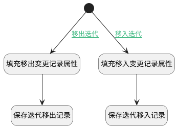

## 迭代变更触发逻辑 <!-- {docsify-ignore-all} -->

   迭代变更触发逻辑，记录迭代移入移出记录

### 处理过程

### 处理步骤说明

#### 开始 :id=Begin [开始]

*- N/A*
#### 填充移出变更记录属性 :id=PREPAREPARAM1 [准备参数]

1. 将`Last(变更前工作项).sprint_id` 设置给  `shift_out(移出迭代变更记录).SPRINT_ID(迭代标识)`
2. 将`Default(传入变量).ID(标识)` 设置给  `shift_out(移出迭代变更记录).WORK_ITEM_ID(工作项标识)`
3. 将`2` 设置给  `shift_out(移出迭代变更记录).TYPE(类型)`
4. 将`Last(变更前工作项).sprint_status` 设置给  `shift_out(移出迭代变更记录).SPRINT_STATUS(迭代状态)`

#### 填充移入变更记录属性 :id=PREPAREPARAM2 [准备参数]

1. 将`Default(传入变量).SPRINT_ID(迭代标识)` 设置给  `shift_in(移入迭代变更记录).SPRINT_ID(迭代标识)`
2. 将`Default(传入变量).SPRINT_STATUS(迭代状态)` 设置给  `shift_in(移入迭代变更记录).SPRINT_STATUS(迭代状态)`
3. 将`1` 设置给  `shift_in(移入迭代变更记录).TYPE(类型)`
4. 将`Default(传入变量).ID(标识)` 设置给  `shift_in(移入迭代变更记录).WORK_ITEM_ID(工作项标识)`

#### 保存迭代移出记录 :id=DEACTION1 [实体行为]

调用实体 [迭代变更(SPRINT_ALTERATION)](module/ProjMgmt/sprint_alteration.md) 行为 [Create](module/ProjMgmt/sprint_alteration#行为) ，行为参数为`shift_out(移出迭代变更记录)`

#### 保存迭代移入记录 :id=DEACTION2 [实体行为]

调用实体 [迭代变更(SPRINT_ALTERATION)](module/ProjMgmt/sprint_alteration.md) 行为 [Create](module/ProjMgmt/sprint_alteration#行为) ，行为参数为`shift_in(移入迭代变更记录)`

### 连接条件说明
#### 移出迭代 :id=Begin-PREPAREPARAM1

`Last(变更前工作项).sprint_id` ISNOTNULL
#### 移入迭代 :id=Begin-PREPAREPARAM2

`Default(传入变量).SPRINT_ID(迭代标识)` ISNOTNULL

### 实体逻辑参数

|    中文名   |    代码名    |  数据类型    |  实体   |备注 |
| --------| --------| -------- | -------- | --------   |
|传入变量(<i class="fa fa-check"/></i>)|Default|数据对象|[工作项(WORK_ITEM)](module/ProjMgmt/work_item.md)||
|变更前工作项|Last|最后数据变量|||
|移入迭代变更记录|shift_in|数据对象|[迭代变更(SPRINT_ALTERATION)](module/ProjMgmt/sprint_alteration.md)||
|移出迭代变更记录|shift_out|数据对象|[迭代变更(SPRINT_ALTERATION)](module/ProjMgmt/sprint_alteration.md)||
