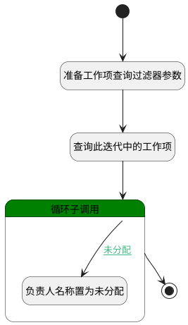

## 迭代成员工作项图表查询 <!-- {docsify-ignore-all} -->

   迭代成员工作项图表查询

### 处理过程

### 处理步骤说明

#### 开始 :id=Begin [开始]

*- N/A*
#### 准备工作项查询过滤器参数 :id=PREPAREPARAM1 [准备参数]

1. 将`Default(传入变量).sprint` 设置给  `Default(传入变量).n_sprint_id_eq`
2. 将`0` 设置给  `Default(传入变量).n_is_deleted_eq`
3. 将`Default(传入变量).project` 设置给  `Default(传入变量).n_project_id_eq`
4. 将`1000` 设置给  `Default(传入变量).size`

#### 查询此迭代中的工作项 :id=DEDATASET1 [实体数据集]

调用实体 [工作项(WORK_ITEM)](module/ProjMgmt/work_item.md) 数据集合 [数据集(DEFAULT)](module/ProjMgmt/work_item#数据集合) ，查询参数为`Default(传入变量)`

将执行结果返回给参数`work_item_page(工作项分页查询结果变量)`

#### 循环子调用 :id=LOOPSUBCALL1 [循环子调用]

循环参数`work_item_page(工作项分页查询结果变量)`，子循环参数使用`for_obj(循环临时变量)`
#### 负责人名称置为未分配 :id=PREPAREPARAM2 [准备参数]

1. 将`未分配` 设置给  `for_obj(循环临时变量).ASSIGNEE_NAME(负责人)`

#### 结束 :id=END1 [结束]

返回 `work_item_page(工作项分页查询结果变量)`

### 连接条件说明
#### 未分配 :id=LOOPSUBCALL1-PREPAREPARAM2

`for_obj(循环临时变量).ASSIGNEE_NAME(负责人)` ISNULL

### 实体逻辑参数

|    中文名   |    代码名    |  数据类型    |  实体   |备注 |
| --------| --------| -------- | -------- | --------   |
|传入变量(<i class="fa fa-check"/></i>)|Default|过滤器|||
|循环临时变量|for_obj|数据对象|[工作项(WORK_ITEM)](module/ProjMgmt/work_item.md)||
|工作项分页查询结果变量|work_item_page|分页查询|||
