## 成员负荷报告 <!-- {docsify-ignore-all} -->

   成员负荷报告数据源

### 处理过程

```plantuml
@startuml
hide empty description
<style>
root {
  HyperlinkColor #42b983
}
</style>

hide empty description
state "开始" as Begin <<start>> [[$./sprint_user_stat#begin {"开始"}]]
state "结束" as END1 <<end>> [[$./sprint_user_stat#end1 {"结束"}]]
state "查询成员负荷报告" as RAWSQLCALL1  [[$./sprint_user_stat#rawsqlcall1 {"查询成员负荷报告"}]]


Begin --> RAWSQLCALL1
RAWSQLCALL1 --> END1


@enduml
```




### 处理步骤说明

#### 开始 :id=Begin<sup class="footnote-symbol"> <font color=gray size=1>[开始]</font></sup>


*- N/A*
#### 结束 :id=END1<sup class="footnote-symbol"> <font color=gray size=1>[结束]</font></sup>


返回 `result(结果)`

#### 查询成员负荷报告 :id=RAWSQLCALL1<sup class="footnote-symbol"> <font color=gray size=1>[直接SQL调用]</font></sup>


<p class="panel-title"><b>执行sql语句</b></p>

```sql
SELECT
  SUM(CASE WHEN t3.`TYPE` != 'completed' THEN 1 ELSE 0 END) AS count2,
  SUM(CASE WHEN t3.`TYPE` = 'completed' THEN 1 ELSE 0 END) AS count,
  COUNT(*) AS sum_count,
  IF(TRIM(t1.`ASSIGNEE_ID`) IS NULL, '未分组', t1.`ASSIGNEE_ID`) AS filter_type
FROM
  `WORK_ITEM` t1
LEFT JOIN
  `WORK_ITEM_STATE` t3 ON t1.`STATE` = t3.`ID`
WHERE
  t1.`PROJECT_ID` = ?
  AND t1.`IS_DELETED` = 0
	AND ((? IS NULL OR ? = '') OR FIND_IN_SET(t1.sprint_id, ?))
	AND ((? IS NULL OR ? = '') OR FIND_IN_SET(t1.release_id, ?))
	AND ((? IS NULL OR ? = '') OR FIND_IN_SET(t1.WORK_ITEM_TYPE_ID, ?))
GROUP BY
  filter_type;

```

<p class="panel-title"><b>执行sql参数</b></p>

1. `Default(传入变量).n_project_id_eq`
2. `Default(传入变量).n_sprint_id_eq`
3. `Default(传入变量).n_sprint_id_eq`
4. `Default(传入变量).n_sprint_id_eq`
5. `Default(传入变量).n_release_id_eq`
6. `Default(传入变量).n_release_id_eq`
7. `Default(传入变量).n_release_id_eq`
8. `Default(传入变量).n_work_item_type_id_eq`
9. `Default(传入变量).n_work_item_type_id_eq`
10. `Default(传入变量).n_work_item_type_id_eq`

重置参数`result(结果)`，并将执行sql结果赋值给参数`result(结果)`


### 实体逻辑参数

|    中文名   |    代码名    |  数据类型    |  实体   |备注 |
| --------| --------| -------- | -------- | --------   |
|传入变量(<i class="fa fa-check"/></i>)|Default|过滤器|||
|结果|result|数据对象列表|||
