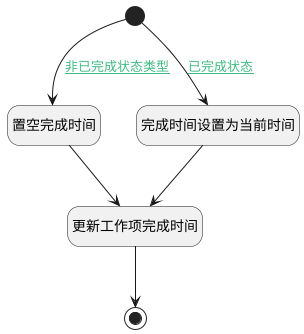

## 状态类型变更附加逻辑 <!-- {docsify-ignore-all} -->

   已完成时，填充完成时间

### 处理过程




### 处理步骤说明

#### 开始 :id=Begin<sup class="footnote-symbol"> <font color=gray size=1>[开始]</font></sup>


*- N/A*
#### 置空完成时间 :id=PREPAREPARAM1<sup class="footnote-symbol"> <font color=gray size=1>[准备参数]</font></sup>


1. 将`空值（NULL）` 设置给  `update_obj(后续更新工作项对象).COMPLETED_AT(完成时间)`
2. 将`Default(传入变量).ID(标识)` 设置给  `update_obj(后续更新工作项对象).ID(标识)`

#### 完成时间设置为当前时间 :id=RAWSFCODE1<sup class="footnote-symbol"> <font color=gray size=1>[直接后台代码]</font></sup>


<p class="panel-title"><b>执行代码[JavaScript]</b></p>

```javascript
var _default = logic.getParam('Default');
var update_obj = logic.getParam('update_obj');
update_obj.set('id', _default.get('id'));
update_obj.set('completed_at', new Date());
```

#### 更新工作项完成时间 :id=DEACTION1<sup class="footnote-symbol"> <font color=gray size=1>[实体行为]</font></sup>


调用实体 [工作项(WORK_ITEM)](module/ProjMgmt/work_item.md) 行为 [Update](module/ProjMgmt/work_item#行为) ，行为参数为`update_obj(后续更新工作项对象)`

将执行结果返回给参数`update_obj(后续更新工作项对象)`

#### 结束 :id=END1<sup class="footnote-symbol"> <font color=gray size=1>[结束]</font></sup>


*- N/A*


### 连接条件说明
#### 非已完成状态类型 :id=Begin-PREPAREPARAM1

`Default(传入变量).STATE_TYPE(工作项状态类型)` NOTEQ `completed` AND `Default(传入变量).COMPLETED_AT(完成时间)` ISNOTNULL
#### 已完成状态 :id=Begin-RAWSFCODE1

`Default(传入变量).STATE_TYPE(工作项状态类型)` EQ `completed`


### 实体逻辑参数

|    中文名   |    代码名    |  数据类型    |  实体   |备注 |
| --------| --------| -------- | -------- | --------   |
|传入变量(<i class="fa fa-check"/></i>)|Default|数据对象|[工作项(WORK_ITEM)](module/ProjMgmt/work_item.md)||
|后续更新工作项对象|update_obj|数据对象|[工作项(WORK_ITEM)](module/ProjMgmt/work_item.md)||
