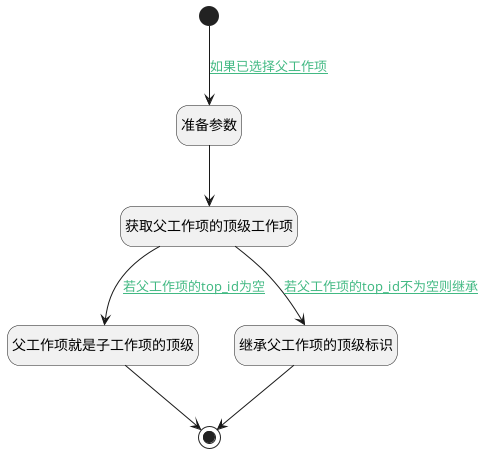

## 顶级工作项 <!-- {docsify-ignore-all} -->

   创建时继承父工作项的顶级工作项

### 处理过程

### 处理步骤说明

#### 开始 :id=Begin [开始]

*- N/A*
#### 准备参数 :id=PREPAREPARAM1 [准备参数]

1. 将`Default(传入变量).PID(父标识)` 设置给  `parent_item(父工作项).ID(标识)`

#### 获取父工作项的顶级工作项 :id=DEACTION1 [实体行为]

调用实体 [工作项(WORK_ITEM)](module/ProjMgmt/work_item.md) 行为 [Get](module/ProjMgmt/work_item#行为) ，行为参数为`parent_item(父工作项)`

将执行结果返回给参数`parent_item(父工作项)`

#### 父工作项就是子工作项的顶级 :id=PREPAREPARAM3 [准备参数]

1. 将`parent_item(父工作项).ID(标识)` 设置给  `Default(传入变量).TOP_ID(顶级工作项标识)`

#### 继承父工作项的顶级标识 :id=PREPAREPARAM2 [准备参数]

1. 将`parent_item(父工作项).TOP_ID(顶级工作项标识)` 设置给  `Default(传入变量).TOP_ID(顶级工作项标识)`

#### 结束 :id=END1 [结束]

返回 `Default(传入变量)`

### 连接条件说明
#### 如果已选择父工作项 :id=Begin-PREPAREPARAM1

`Default(传入变量).PID(父标识)` ISNOTNULL
#### 若父工作项的top_id不为空则继承 :id=DEACTION1-PREPAREPARAM2

`parent_item(父工作项).TOP_ID(顶级工作项标识)` ISNOTNULL
#### 若父工作项的top_id为空 :id=DEACTION1-PREPAREPARAM3

`parent_item(父工作项).TOP_ID(顶级工作项标识)` ISNULL

### 实体逻辑参数

|    中文名   |    代码名    |  数据类型    |  实体   |备注 |
| --------| --------| -------- | -------- | --------   |
|传入变量(<i class="fa fa-check"/></i>)|Default|数据对象|[工作项(WORK_ITEM)](module/ProjMgmt/work_item.md)||
|父工作项|parent_item|数据对象|[工作项(WORK_ITEM)](module/ProjMgmt/work_item.md)||
