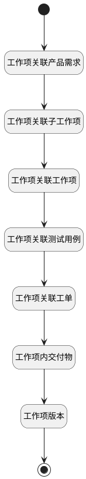

## 工作项历史版本关联分页计数器 <!-- {docsify-ignore-all} -->

   计算分页下关联事项的条数

### 处理过程




### 处理步骤说明

#### 开始 :id=Begin<sup class="footnote-symbol"> <font color=gray size=1>[开始]</font></sup>


*- N/A*
#### 结束 :id=END1<sup class="footnote-symbol"> <font color=gray size=1>[结束]</font></sup>


返回 `Default(传入变量)`

#### 工作项关联产品需求 :id=RAWSQLCALL1<sup class="footnote-symbol"> <font color=gray size=1>[直接SQL调用]</font></sup>


<p class="panel-title"><b>执行sql语句</b></p>

```sql
SELECT
	count( t.id ) AS work_item_re_idea 
FROM
	idea t 
WHERE
	EXISTS (
	SELECT
			*
	FROM
		version_data t12
	WHERE
		 ( t12.`OWNER_TYPE` = 'RELATION' AND t12.`PARENT_ID` = ? ) 
		AND t12.PARENT_VERSION_ID = ?
		AND t.`ID` =  JSON_UNQUOTE(t12.`DATA`-> '$.target_id') 
	) 
	AND t.`IS_DELETED` = 0
```

<p class="panel-title"><b>执行sql参数</b></p>

1. `Default(传入变量).ID(标识)`
2. `Default(传入变量).srfversionid`

重置参数`Default(传入变量)`，并将执行sql结果赋值给参数`Default(传入变量)`

#### 工作项关联子工作项 :id=RAWSQLCALL2<sup class="footnote-symbol"> <font color=gray size=1>[直接SQL调用]</font></sup>


<p class="panel-title"><b>执行sql语句</b></p>

```sql
SELECT
	count( t.id ) AS work_item_re_children
FROM
	work_item t 
WHERE
	t.pid = ? and t.is_deleted = 0
```

<p class="panel-title"><b>执行sql参数</b></p>

1. `Default(传入变量).ID(标识)`

重置参数`Default(传入变量)`，并将执行sql结果赋值给参数`Default(传入变量)`

#### 工作项关联工作项 :id=RAWSQLCALL3<sup class="footnote-symbol"> <font color=gray size=1>[直接SQL调用]</font></sup>


<p class="panel-title"><b>执行sql语句</b></p>

```sql
SELECT
	count( t.id ) AS work_item_re_work_item
FROM
	work_item t 
WHERE
	EXISTS (
	SELECT
		* 
	FROM
		`RELATION` t11 
	WHERE
		t.`ID` = t11.`TARGET_ID` 
		AND (
			t11.`TARGET_TYPE` = 'work_item' 
			AND t11.`PRINCIPAL_TYPE` = 'work_item' 
			AND t11.`PRINCIPAL_ID` = ? ) )
			AND t.`IS_DELETED` = 0 
			
```

<p class="panel-title"><b>执行sql参数</b></p>

1. `Default(传入变量).ID(标识)`

重置参数`Default(传入变量)`，并将执行sql结果赋值给参数`Default(传入变量)`

#### 工作项关联测试用例 :id=RAWSQLCALL4<sup class="footnote-symbol"> <font color=gray size=1>[直接SQL调用]</font></sup>


<p class="panel-title"><b>执行sql语句</b></p>

```sql
SELECT
	count( t.id ) AS work_item_re_test_case
FROM
	test_case t 
WHERE
	EXISTS (
	SELECT
		* 
	FROM
		`RELATION` t11 
	WHERE
		t.`ID` = t11.`TARGET_ID` 
		AND (
			t11.`TARGET_TYPE` = 'test_case' 
			AND (t11.`PRINCIPAL_TYPE` = 'work_item' OR t11.`PRINCIPAL_TYPE` = 'bug')
			AND t11.`PRINCIPAL_ID` = ? ) )
			AND t.`IS_DELETED` = 0
```

<p class="panel-title"><b>执行sql参数</b></p>

1. `Default(传入变量).ID(标识)`

重置参数`Default(传入变量)`，并将执行sql结果赋值给参数`Default(传入变量)`

#### 工作项关联工单 :id=RAWSQLCALL5<sup class="footnote-symbol"> <font color=gray size=1>[直接SQL调用]</font></sup>


<p class="panel-title"><b>执行sql语句</b></p>

```sql
SELECT
	count( t.id ) AS work_item_re_ticket
FROM
	ticket t 
WHERE
	EXISTS (
	SELECT
		* 
	FROM
		`RELATION` t11 
	WHERE
		t.`ID` = t11.`TARGET_ID` 
		AND (
			t11.`TARGET_TYPE` = 'ticket' 
			AND t11.`PRINCIPAL_TYPE` = 'work_item' 
			AND t11.`PRINCIPAL_ID` = ? ) )
			AND t.`IS_DELETED` = 0 
			
```

<p class="panel-title"><b>执行sql参数</b></p>

1. `Default(传入变量).ID(标识)`

重置参数`Default(传入变量)`，并将执行sql结果赋值给参数`Default(传入变量)`

#### 工作项内交付物 :id=RAWSQLCALL6<sup class="footnote-symbol"> <font color=gray size=1>[直接SQL调用]</font></sup>


<p class="panel-title"><b>执行sql语句</b></p>

```sql
	SELECT
	count( t.id ) AS work_item_deliverable
FROM
	attachment t 
WHERE
    t.owner_id = ? and t.owner_subtype='DELIVERABLE' and t.owner_type = 'WORK_ITEM'
```

<p class="panel-title"><b>执行sql参数</b></p>

1. `Default(传入变量).ID(标识)`

重置参数`Default(传入变量)`，并将执行sql结果赋值给参数`Default(传入变量)`

#### 工作项版本 :id=RAWSQLCALL7<sup class="footnote-symbol"> <font color=gray size=1>[直接SQL调用]</font></sup>


<p class="panel-title"><b>执行sql语句</b></p>

```sql
	SELECT
	count( t.id ) AS work_item_version
FROM
	`version` t 
WHERE
    t.owner_id = ? and  t.owner_type = 'WORK_ITEM'
```

<p class="panel-title"><b>执行sql参数</b></p>

1. `Default(传入变量).ID(标识)`

重置参数`Default(传入变量)`，并将执行sql结果赋值给参数`Default(传入变量)`


### 实体逻辑参数

|    中文名   |    代码名    |  数据类型    |  实体   |备注 |
| --------| --------| -------- | -------- | --------   |
|传入变量(<i class="fa fa-check"/></i>)|Default|数据对象|[工作项(WORK_ITEM)](module/ProjMgmt/work_item.md)||
