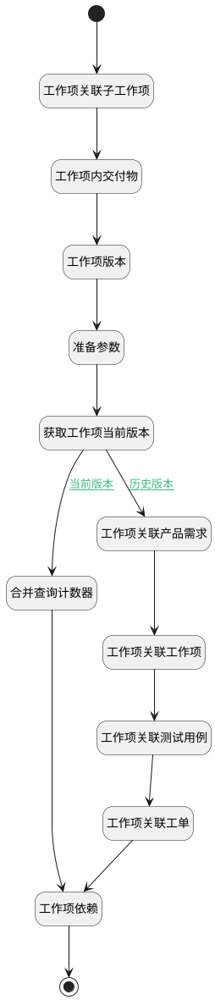

## 工作项关联分页计数器 <!-- {docsify-ignore-all} -->

   计算分页下关联事项的条数

### 处理过程




### 处理步骤说明

#### 合并查询计数器 :id=RAWSQLCALL12<sup class="footnote-symbol"> <font color=gray size=1>[直接SQL调用]</font></sup>


<p class="panel-title"><b>执行sql语句</b></p>

```sql
SELECT
     COALESCE(SUM(CASE WHEN t11.`TARGET_TYPE` = 'idea' AND t11.`PRINCIPAL_TYPE` = 'work_item' AND t1.IS_DELETED=0  THEN 1 ELSE 0 END),0) AS work_item_re_idea,
     COALESCE(SUM(CASE WHEN t11.`TARGET_TYPE` = 'work_item' AND t11.`PRINCIPAL_TYPE` = 'work_item' AND t4.IS_DELETED=0 THEN 1 ELSE 0 END),0)  AS work_item_re_work_item,
     COALESCE(SUM(CASE WHEN t11.`TARGET_TYPE` = 'test_case' AND t11.`PRINCIPAL_TYPE` = 'work_item' AND t5.IS_DELETED=0 THEN 1 ELSE 0 END),0)  AS work_item_re_test_case,
     COALESCE(SUM(CASE WHEN t11.`TARGET_TYPE` = 'ticket' AND t11.`PRINCIPAL_TYPE` = 'work_item' AND t3.IS_DELETED=0 THEN 1 ELSE 0 END),0)  AS work_item_re_ticket
FROM
    `RELATION` t11
JOIN
    `work_item` t ON t.`ID` = t11.`PRINCIPAL_ID`
LEFT JOIN
    `idea` t1 ON t1.ID = t11.TARGET_ID 
LEFT JOIN
    `ticket` t3 ON t3.ID = t11.TARGET_ID 
LEFT JOIN
    `work_item` t4 ON t4.ID = t11.TARGET_ID
LEFT JOIN
    `test_case` t5 ON t5.ID = t11.TARGET_ID
WHERE
    (t11.`PRINCIPAL_ID` = ? );
```

<p class="panel-title"><b>执行sql参数</b></p>

1. `Default(传入变量).ID(标识)`

重置参数`Default(传入变量)`，并将执行sql结果赋值给参数`Default(传入变量)`

#### 结束 :id=END2<sup class="footnote-symbol"> <font color=gray size=1>[结束]</font></sup>


返回 `Default(传入变量)`

#### 开始 :id=Begin<sup class="footnote-symbol"> <font color=gray size=1>[开始]</font></sup>


*- N/A*
#### 工作项依赖 :id=RAWSQLCALL13<sup class="footnote-symbol"> <font color=gray size=1>[直接SQL调用]</font></sup>


<p class="panel-title"><b>执行sql语句</b></p>

```sql
SELECT
count(t1.id) as `dependency`
FROM `RELATION` t1 
WHERE 
( ( exists(select 1 from work_item t2 where t1.principal_id = t2.id and t1.principal_id = ? and t2.is_deleted = 0)  
OR  exists(select 1 from work_item t2 where t1.target_id= t2.id and t1.target_id= ? and t2.is_deleted = 0) )  
AND  t1.`PRINCIPAL_TYPE` = 'dependency' )
```

<p class="panel-title"><b>执行sql参数</b></p>

1. `work_item(工作项).ID(标识)`
2. `work_item(工作项).ID(标识)`

重置参数`Default(传入变量)`，并将执行sql结果赋值给参数`Default(传入变量)`

#### 工作项关联子工作项 :id=RAWSQLCALL2<sup class="footnote-symbol"> <font color=gray size=1>[直接SQL调用]</font></sup>


<p class="panel-title"><b>执行sql语句</b></p>

```sql
SELECT
	count( t.id ) AS work_item_re_children
FROM
	work_item t 
WHERE
	t.pid = ? and t.is_deleted = 0
```

<p class="panel-title"><b>执行sql参数</b></p>

1. `Default(传入变量).ID(标识)`

重置参数`Default(传入变量)`，并将执行sql结果赋值给参数`Default(传入变量)`

#### 工作项内交付物 :id=RAWSQLCALL6<sup class="footnote-symbol"> <font color=gray size=1>[直接SQL调用]</font></sup>


<p class="panel-title"><b>执行sql语句</b></p>

```sql
	SELECT
	count( t.id ) AS work_item_deliverable
FROM
	attachment t 
WHERE
    t.owner_id = ? and t.owner_subtype='DELIVERABLE' and t.owner_type = 'WORK_ITEM'
```

<p class="panel-title"><b>执行sql参数</b></p>

1. `Default(传入变量).ID(标识)`

重置参数`Default(传入变量)`，并将执行sql结果赋值给参数`Default(传入变量)`

#### 工作项版本 :id=RAWSQLCALL7<sup class="footnote-symbol"> <font color=gray size=1>[直接SQL调用]</font></sup>


<p class="panel-title"><b>执行sql语句</b></p>

```sql
	SELECT
	count( t.id ) AS work_item_version
FROM
	`version` t 
WHERE
    t.owner_id = ? and  t.owner_type = 'WORK_ITEM'
```

<p class="panel-title"><b>执行sql参数</b></p>

1. `Default(传入变量).ID(标识)`

重置参数`Default(传入变量)`，并将执行sql结果赋值给参数`Default(传入变量)`

#### 准备参数 :id=PREPAREPARAM1<sup class="footnote-symbol"> <font color=gray size=1>[准备参数]</font></sup>


1. 将`Default(传入变量).ID(标识)` 设置给  `work_item(工作项).ID(标识)`

#### 获取工作项当前版本 :id=DEACTION1<sup class="footnote-symbol"> <font color=gray size=1>[实体行为]</font></sup>


调用实体 [工作项(WORK_ITEM)](module/ProjMgmt/work_item.md) 行为 [Get](module/ProjMgmt/work_item#行为) ，行为参数为`work_item(工作项)`

将执行结果返回给参数`work_item(工作项)`

#### 工作项关联产品需求 :id=RAWSQLCALL8<sup class="footnote-symbol"> <font color=gray size=1>[直接SQL调用]</font></sup>


<p class="panel-title"><b>执行sql语句</b></p>

```sql
SELECT
	count( t.id ) AS work_item_re_idea 
FROM
	idea t 
WHERE
	EXISTS (
	SELECT
			*
	FROM
		version_data t12
	WHERE
		 ( t12.`OWNER_TYPE` = 'RELATION' AND t12.`PARENT_ID` = ? ) 
		AND t12.PARENT_VERSION_ID = ?
		AND t.`ID` =  JSON_UNQUOTE(t12.`DATA`-> '$.target_id') 
	) 
	AND t.`IS_DELETED` = 0
```

<p class="panel-title"><b>执行sql参数</b></p>

1. `Default(传入变量).ID(标识)`
2. `Default(传入变量).srfversionid`

重置参数`Default(传入变量)`，并将执行sql结果赋值给参数`Default(传入变量)`

#### 工作项关联工作项 :id=RAWSQLCALL9<sup class="footnote-symbol"> <font color=gray size=1>[直接SQL调用]</font></sup>


<p class="panel-title"><b>执行sql语句</b></p>

```sql
SELECT
	count( t.id ) AS work_item_re_work_item 
FROM
	work_item t 
WHERE
	EXISTS (
	SELECT
			*
	FROM
		version_data t12
	WHERE
		 ( t12.`OWNER_TYPE` = 'RELATION' AND t12.`PARENT_ID` = ? ) 
		AND t12.PARENT_VERSION_ID = ?
		AND t.`ID` =  JSON_UNQUOTE(t12.`DATA`-> '$.target_id') 
	) 
	AND t.`IS_DELETED` = 0
```

<p class="panel-title"><b>执行sql参数</b></p>

1. `Default(传入变量).ID(标识)`
2. `Default(传入变量).srfversionid`

重置参数`Default(传入变量)`，并将执行sql结果赋值给参数`Default(传入变量)`

#### 工作项关联测试用例 :id=RAWSQLCALL10<sup class="footnote-symbol"> <font color=gray size=1>[直接SQL调用]</font></sup>


<p class="panel-title"><b>执行sql语句</b></p>

```sql
SELECT
	count( t.id ) AS work_item_re_test_case
FROM
	test_case t 
WHERE
	EXISTS (
	SELECT
			*
	FROM
		version_data t12
	WHERE
		 ( t12.`OWNER_TYPE` = 'RELATION' AND t12.`PARENT_ID` = ? ) 
		AND t12.PARENT_VERSION_ID = ?
		AND t.`ID` =  JSON_UNQUOTE(t12.`DATA`-> '$.target_id') 
	) 
	AND t.`IS_DELETED` = 0
```

<p class="panel-title"><b>执行sql参数</b></p>

1. `Default(传入变量).ID(标识)`
2. `Default(传入变量).srfversionid`

重置参数`Default(传入变量)`，并将执行sql结果赋值给参数`Default(传入变量)`

#### 工作项关联工单 :id=RAWSQLCALL11<sup class="footnote-symbol"> <font color=gray size=1>[直接SQL调用]</font></sup>


<p class="panel-title"><b>执行sql语句</b></p>

```sql
SELECT
	count( t.id ) AS work_item_re_ticket 
FROM
	ticket t 
WHERE
	EXISTS (
	SELECT
			*
	FROM
		version_data t12
	WHERE
		 ( t12.`OWNER_TYPE` = 'RELATION' AND t12.`PARENT_ID` = ? ) 
		AND t12.PARENT_VERSION_ID = ?
		AND t.`ID` =  JSON_UNQUOTE(t12.`DATA`-> '$.target_id') 
	) 
	AND t.`IS_DELETED` = 0
```

<p class="panel-title"><b>执行sql参数</b></p>

1. `Default(传入变量).ID(标识)`
2. `Default(传入变量).srfversionid`

重置参数`Default(传入变量)`，并将执行sql结果赋值给参数`Default(传入变量)`


### 连接条件说明
#### 当前版本 :id=DEACTION1-RAWSQLCALL12

((`Default(传入变量).srfversionid` ISNOTNULL AND ) OR `Default(传入变量).srfversionid` ISNULL)
#### 历史版本 :id=DEACTION1-RAWSQLCALL8

`Default(传入变量).srfversionid` ISNOTNULL AND 


### 实体逻辑参数

|    中文名   |    代码名    |  数据类型    |  实体   |备注 |
| --------| --------| -------- | -------- | --------   |
|传入变量(<i class="fa fa-check"/></i>)|Default|数据对象|[工作项(WORK_ITEM)](module/ProjMgmt/work_item.md)||
|工作项|work_item|数据对象|[工作项(WORK_ITEM)](module/ProjMgmt/work_item.md)||
