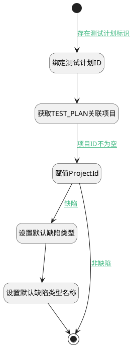

## 获取测试计划对应项目 <!-- {docsify-ignore-all} -->

   获取测试计划对应项目

### 处理过程




### 处理步骤说明

#### 开始 :id=Begin<sup class="footnote-symbol"> <font color=gray size=1>[开始]</font></sup>


*- N/A*
#### 绑定测试计划ID :id=PREPAREPARAM1<sup class="footnote-symbol"> <font color=gray size=1>[准备参数]</font></sup>


1. 将`Default(传入变量).TEST_PLAN_ID(测试计划ID)` 设置给  `test_plan.ID(标识)`

#### 获取TEST_PLAN关联项目 :id=DEACTION1<sup class="footnote-symbol"> <font color=gray size=1>[实体行为]</font></sup>


调用实体 [测试计划(TEST_PLAN)](module/TestMgmt/test_plan.md) 行为 [Get](module/TestMgmt/test_plan#行为) ，行为参数为`test_plan`

将执行结果返回给参数`test_plan`

#### 赋值ProjectId :id=PREPAREPARAM2<sup class="footnote-symbol"> <font color=gray size=1>[准备参数]</font></sup>


1. 将`test_plan.PROJECT_ID(关联项目)` 设置给  `Default(传入变量).PROJECT_ID(项目)`
2. 将`空值（NULL）` 设置给  `Default(传入变量).ID(标识)`
3. 将`test_plan.PROJECT_NAME(关联项目)` 设置给  `Default(传入变量).PROJECT_NAME(所属项目)`

#### 设置默认缺陷类型 :id=RAWSFCODE1<sup class="footnote-symbol"> <font color=gray size=1>[直接后台代码]</font></sup>


<p class="panel-title"><b>执行代码[JavaScript]</b></p>

```javascript
var Default = logic.getParam("Default");
var test_plan = logic.getParam("test_plan");
if(test_plan.get("project_type") != null){
    Default.set("work_item_type_id", test_plan.get("project_type") + "_bug");
}
```

#### 结束 :id=END1<sup class="footnote-symbol"> <font color=gray size=1>[结束]</font></sup>


返回 `Default(传入变量)`

#### 设置默认缺陷类型名称 :id=PREPAREPARAM3<sup class="footnote-symbol"> <font color=gray size=1>[准备参数]</font></sup>


1. 将`缺陷` 设置给  `Default(传入变量).WORK_ITEM_TYPE_NAME(工作项类型)`


### 连接条件说明
#### 存在测试计划标识 :id=Begin-PREPAREPARAM1

`Default(传入变量).TEST_PLAN_ID(测试计划ID)` ISNOTNULL
#### 项目ID不为空 :id=DEACTION1-PREPAREPARAM2

`test_plan(test_plan).PROJECT_ID(关联项目)` ISNOTNULL
#### 非缺陷 :id=PREPAREPARAM2-END1

`Default(传入变量).work_item_type_group_bug` ISNULL
#### 缺陷 :id=PREPAREPARAM2-RAWSFCODE1

`Default(传入变量).work_item_type_group_bug` ISNOTNULL


### 实体逻辑参数

|    中文名   |    代码名    |  数据类型    |  实体   |备注 |
| --------| --------| -------- | -------- | --------   |
|传入变量(<i class="fa fa-check"/></i>)|Default|数据对象|[工作项(WORK_ITEM)](module/ProjMgmt/work_item.md)||
|ctx|ctx|数据对象|||
|test_plan|test_plan|数据对象|[测试计划(TEST_PLAN)](module/TestMgmt/test_plan.md)||
