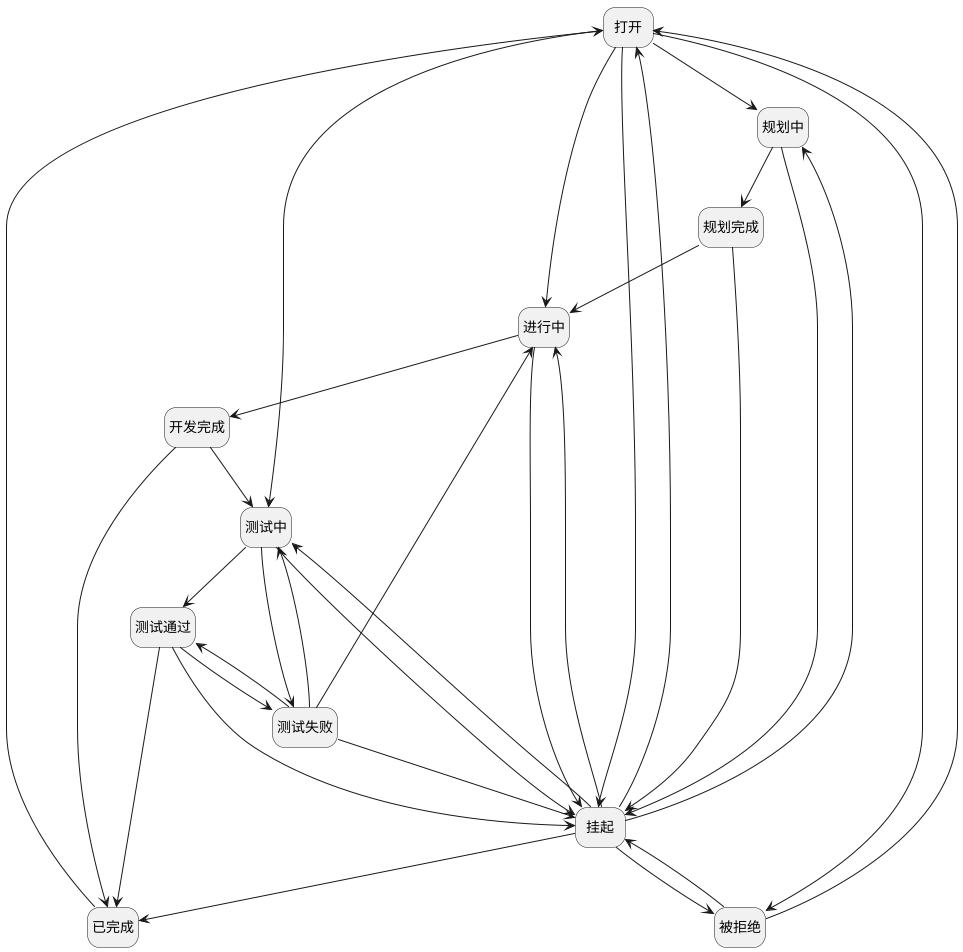

## Scrum项目-缺陷-状态迁移 <!-- {docsify-ignore-all} -->

   

### 主状态迁移

### 主状态说明

#### 规划中 :id=MAINSTATE5 [14]

###### 拒绝行为

###### 拒绝操作标识

###### 允许属性

#### 打开 :id=MAINSTATE1 [10]

###### 拒绝行为

###### 拒绝操作标识

###### 拒绝属性

#### 被拒绝 :id=MAINSTATE7 [60]

###### 拒绝行为

###### 拒绝操作标识

###### 允许属性

#### 规划完成 :id=MAINSTATE6 [16]

###### 拒绝行为

###### 拒绝操作标识

###### 允许属性

#### 进行中 :id=MAINSTATE2 [20]

###### 拒绝行为

###### 拒绝操作标识

###### 拒绝属性

#### 挂起 :id=MAINSTATE4 [50]

###### 拒绝行为

###### 拒绝操作标识

###### 拒绝属性

#### 开发完成 :id=MAINSTATE8 [30]

###### 拒绝行为

###### 拒绝操作标识

###### 允许属性

#### 已完成 :id=MAINSTATE3 [40]

###### 拒绝行为

###### 拒绝操作标识

###### 拒绝属性

#### 测试中 :id=MAINSTATE9 [32]

###### 拒绝行为

###### 拒绝操作标识

###### 允许属性

#### 测试失败 :id=MAINSTATE11 [36]

###### 拒绝行为

###### 拒绝操作标识

###### 允许属性

#### 测试通过 :id=MAINSTATE10 [34]

###### 拒绝行为

###### 拒绝操作标识

###### 允许属性

