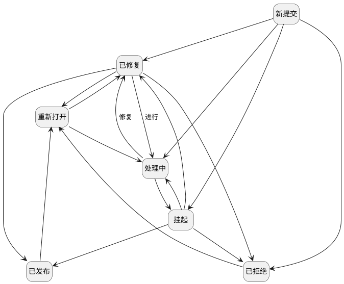

## Scrum项目-缺陷-状态迁移 <!-- {docsify-ignore-all} -->

   

### 主状态迁移

### 主状态说明

#### 新提交 :id=MAINSTATE1 [10]

###### 拒绝行为

###### 拒绝操作标识

###### 拒绝属性

#### 处理中 :id=MAINSTATE2 [20]

###### 拒绝行为

###### 拒绝操作标识

###### 拒绝属性

#### 已修复 :id=MAINSTATE3 [30]

###### 拒绝行为

###### 拒绝操作标识

###### 拒绝属性

#### 已拒绝 :id=MAINSTATE4 [60]

###### 拒绝行为

###### 拒绝操作标识

###### 拒绝属性

#### 重新打开 :id=MAINSTATE5 [40]

###### 允许行为

###### 允许操作标识

###### 允许属性

#### 已发布 :id=MAINSTATE6 [50]

###### 允许行为

###### 允许操作标识

###### 允许属性

#### 挂起 :id=MAINSTATE7 [70]

###### 允许行为

###### 允许操作标识

###### 允许属性

