## Scrum项目-任务-状态迁移 <!-- {docsify-ignore-all} -->

   

### 主状态迁移

```plantuml
@startuml
hide empty description
<style>
root {
  HyperlinkColor #42b983
}
</style>

hide empty description
state "打开" as MAINSTATE1  [[$./scrum_task#mainstate1 {"打开"}]]
state "进行中" as MAINSTATE2  [[$./scrum_task#mainstate2 {"进行中"}]]
state "已完成" as MAINSTATE3  [[$./scrum_task#mainstate3 {"已完成"}]]
state "已关闭" as MAINSTATE4  [[$./scrum_task#mainstate4 {"已关闭"}]]


MAINSTATE1 --> MAINSTATE2
MAINSTATE2 --> MAINSTATE3 : 完成
MAINSTATE3 --> MAINSTATE4
MAINSTATE3 --> MAINSTATE2 : 进行
MAINSTATE2 --> MAINSTATE4


@enduml
```

### 主状态说明

#### 打开 :id=MAINSTATE1 [10]

###### 拒绝行为

###### 拒绝操作标识

###### 拒绝属性

#### 进行中 :id=MAINSTATE2 [20]

###### 拒绝行为

###### 拒绝操作标识

###### 拒绝属性

#### 已完成 :id=MAINSTATE3 [30]

###### 拒绝行为

###### 拒绝操作标识

###### 拒绝属性

#### 已关闭 :id=MAINSTATE4 [40]

###### 拒绝行为

###### 拒绝操作标识

###### 拒绝属性

