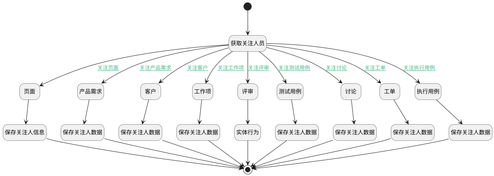

## 关注人员更新 <!-- {docsify-ignore-all} -->

   获取关注人员信息，并根据类别更新

### 处理过程




### 处理步骤说明

#### 开始 :id=Begin<sup class="footnote-symbol"> <font color=gray size=1>[开始]</font></sup>


#### 获取关注人员 :id=PREPAREJSPARAM2<sup class="footnote-symbol"> <font color=gray size=1>[准备参数]</font></sup>


1. 将`view(当前视图对象).layoutPanel.panelItems.container_attention` 绑定给  `attention_container(关注人容器对象)`
2. 将`attention_container(关注人容器对象).panelItems.attentions.value` 设置给  `commit_object(提交对象).attentions`

#### 评审 :id=PREPAREJSPARAM10<sup class="footnote-symbol"> <font color=gray size=1>[准备参数]</font></sup>


1. 将`ctx(应用上下文).review` 设置给  `commit_object(提交对象).id`

#### 页面 :id=PREPAREJSPARAM8<sup class="footnote-symbol"> <font color=gray size=1>[准备参数]</font></sup>


1. 将`ctx(应用上下文).article_page` 设置给  `commit_object(提交对象).id`

#### 工作项 :id=PREPAREJSPARAM1<sup class="footnote-symbol"> <font color=gray size=1>[准备参数]</font></sup>


1. 将`ctx(应用上下文).work_item` 设置给  `commit_object(提交对象).id`

#### 产品需求 :id=PREPAREJSPARAM3<sup class="footnote-symbol"> <font color=gray size=1>[准备参数]</font></sup>


1. 将`ctx(应用上下文).idea` 设置给  `commit_object(提交对象).id`

#### 工单 :id=PREPAREJSPARAM4<sup class="footnote-symbol"> <font color=gray size=1>[准备参数]</font></sup>


1. 将`ctx(应用上下文).ticket` 设置给  `commit_object(提交对象).id`

#### 客户 :id=PREPAREJSPARAM5<sup class="footnote-symbol"> <font color=gray size=1>[准备参数]</font></sup>


1. 将`ctx(应用上下文).customer` 设置给  `commit_object(提交对象).id`

#### 测试用例 :id=PREPAREJSPARAM7<sup class="footnote-symbol"> <font color=gray size=1>[准备参数]</font></sup>


1. 将`ctx(应用上下文).test_case` 设置给  `commit_object(提交对象).id`

#### 执行用例 :id=PREPAREJSPARAM6<sup class="footnote-symbol"> <font color=gray size=1>[准备参数]</font></sup>


1. 将`ctx(应用上下文).run` 设置给  `commit_object(提交对象).id`

#### 讨论 :id=PREPAREJSPARAM9<sup class="footnote-symbol"> <font color=gray size=1>[准备参数]</font></sup>


1. 将`ctx(应用上下文).discuss_post` 设置给  `commit_object(提交对象).id`

#### 实体行为 :id=DEACTION9<sup class="footnote-symbol"> <font color=gray size=1>[实体行为]</font></sup>


调用实体 [评审(REVIEW)](module/TestMgmt/review.md) 行为 [Update](module/TestMgmt/review#行为) ，行为参数为`commit_object(提交对象)`

#### 保存关注人信息 :id=DEACTION7<sup class="footnote-symbol"> <font color=gray size=1>[实体行为]</font></sup>


调用实体 [页面(PAGE)](module/Wiki/article_page.md) 行为 [Update](module/Wiki/article_page#行为) ，行为参数为`commit_object(提交对象)`

#### 保存关注人数据 :id=DEACTION1<sup class="footnote-symbol"> <font color=gray size=1>[实体行为]</font></sup>


调用实体 [工作项(WORK_ITEM)](module/ProjMgmt/work_item.md) 行为 [Update](module/ProjMgmt/work_item#行为) ，行为参数为`commit_object(提交对象)`

#### 保存关注人数据 :id=DEACTION2<sup class="footnote-symbol"> <font color=gray size=1>[实体行为]</font></sup>


调用实体 [需求(IDEA)](module/ProdMgmt/idea.md) 行为 [Update](module/ProdMgmt/idea#行为) ，行为参数为`commit_object(提交对象)`

#### 保存关注人数据 :id=DEACTION3<sup class="footnote-symbol"> <font color=gray size=1>[实体行为]</font></sup>


调用实体 [工单(TICKET)](module/ProdMgmt/ticket.md) 行为 [Update](module/ProdMgmt/ticket#行为) ，行为参数为`commit_object(提交对象)`

#### 保存关注人数据 :id=DEACTION4<sup class="footnote-symbol"> <font color=gray size=1>[实体行为]</font></sup>


调用实体 [客户(CUSTOMER)](module/ProdMgmt/customer.md) 行为 [Update](module/ProdMgmt/customer#行为) ，行为参数为`commit_object(提交对象)`

#### 保存关注人数据 :id=DEACTION5<sup class="footnote-symbol"> <font color=gray size=1>[实体行为]</font></sup>


调用实体 [用例(TEST_CASE)](module/TestMgmt/test_case.md) 行为 [Update](module/TestMgmt/test_case#行为) ，行为参数为`commit_object(提交对象)`

#### 保存关注人数据 :id=DEACTION6<sup class="footnote-symbol"> <font color=gray size=1>[实体行为]</font></sup>


调用实体 [执行用例(RUN)](module/TestMgmt/run.md) 行为 [Update](module/TestMgmt/run#行为) ，行为参数为`commit_object(提交对象)`

#### 保存关注人数据 :id=DEACTION8<sup class="footnote-symbol"> <font color=gray size=1>[实体行为]</font></sup>


调用实体 [讨论(DISCUSS_POST)](module/Team/discuss_post.md) 行为 [Update](module/Team/discuss_post#行为) ，行为参数为`commit_object(提交对象)`

#### 结束 :id=END1<sup class="footnote-symbol"> <font color=gray size=1>[结束]</font></sup>


### 连接条件说明
#### 关注工作项 :id=PREPAREJSPARAM2-PREPAREJSPARAM1

```ctx(应用上下文).work_item``` ISNOTNULL
#### 关注产品需求 :id=PREPAREJSPARAM2-PREPAREJSPARAM3

```ctx(应用上下文).idea``` ISNOTNULL
#### 关注工单 :id=PREPAREJSPARAM2-PREPAREJSPARAM4

```ctx(应用上下文).ticket``` ISNOTNULL
#### 关注客户 :id=PREPAREJSPARAM2-PREPAREJSPARAM5

```ctx(应用上下文).customer``` ISNOTNULL
#### 关注测试用例 :id=PREPAREJSPARAM2-PREPAREJSPARAM7

```ctx(应用上下文).test_case``` ISNOTNULL AND ```ctx(应用上下文).run``` ISNULL
#### 关注执行用例 :id=PREPAREJSPARAM2-PREPAREJSPARAM6

```ctx(应用上下文).run``` ISNOTNULL AND ```ctx(应用上下文).case_id``` ISNOTNULL
#### 关注页面 :id=PREPAREJSPARAM2-PREPAREJSPARAM8

```ctx(应用上下文).article_page``` ISNOTNULL
#### 关注讨论 :id=PREPAREJSPARAM2-PREPAREJSPARAM9

```ctx(应用上下文).discuss_post``` ISNOTNULL
#### 关注评审 :id=PREPAREJSPARAM2-PREPAREJSPARAM10

```ctx(应用上下文).review``` ISNOTNULL


### 实体逻辑参数

|    中文名   |    代码名    |  数据类型      |备注 |
| --------| --------| --------  | --------   |
|关注人容器对象|attention_container|数据对象||
|提交对象|commit_object|数据对象||
|当前视图对象|view|当前视图对象||
|应用上下文|ctx|导航视图参数绑定参数||
|传入变量(<i class="fa fa-check"/></i>)|Default|数据对象||
