## 状态变更前逻辑 <!-- {docsify-ignore-all} -->

   

### 处理过程

```plantuml
@startuml
hide footbox
<style>
root {
  HyperlinkColor #42b983
}
</style>

hide empty description
state "开始" as Begin <<start>> [[$./before_state_change#begin {开始}]]
state "结束" as END1 <<end>> [[$./before_state_change#end1 {结束}]]
state "准备参数" as PREPAREJSPARAM1  [[$./before_state_change#preparejsparam1 {准备参数}]]
state "判断类型是否匹配" as RAWJSCODE1  [[$./before_state_change#rawjscode1 {判断类型是否匹配}]]


Begin --> PREPAREJSPARAM1
PREPAREJSPARAM1 --> RAWJSCODE1
RAWJSCODE1 --> END1


@enduml
```




### 处理步骤说明

#### 开始 :id=Begin<sup class="footnote-symbol"> <font color=gray size=1>[开始]</font></sup>


#### 结束 :id=END1<sup class="footnote-symbol"> <font color=gray size=1>[结束]</font></sup>


#### 准备参数 :id=PREPAREJSPARAM1<sup class="footnote-symbol"> <font color=gray size=1>[准备参数]</font></sup>


1. 将`treegrid(表格).state.selectedData` 拷贝到  `selecteddata(选中数据)`

#### 判断类型是否匹配 :id=RAWJSCODE1<sup class="footnote-symbol"> <font color=gray size=1>[直接前台代码]</font></sup>


<p class="panel-title"><b>执行代码</b></p>

```javascript
const selectedData = uiLogic.selecteddata;
let needDisable = true;
console.log(selectedData);

if (selectedData && selectedData.length > 0) {
    const firstData = selectedData[0];

    for (let i = 0; i < selectedData.length; i++) {
        const curData = selectedData[i];
        const dataType = curData.work_item_type_id;
        if (firstData.work_item_type_id !== dataType) {
            needDisable = true;
            break; 
        } else {
            needDisable = false;
        }
    }
    console.log(needDisable);

}
```


### 实体逻辑参数

|    中文名   |    代码名    |  数据类型      |备注 |
| --------| --------| --------  | --------   |
|传入变量(<i class="fa fa-check"/></i>)|Default|数据对象||
|表格|treegrid|部件对象||
|view|view|当前视图对象||
|选中数据|selecteddata|数据对象列表||
|当前表格|cur_grid|当前部件对象||
|批操作工具栏|detoolbar|数据对象||
