## 状态变更前逻辑——表格 <!-- {docsify-ignore-all} -->

   检测变更状态前选中的数据是否为同一类型，不同则禁用

### 处理过程

```plantuml
@startuml
hide footbox
<style>
root {
  HyperlinkColor #42b983
}
</style>

hide empty description
state "开始" as Begin <<start>> [[$./before_state_change_grid#begin {开始}]]
state "判断类型是否匹配" as RAWJSCODE1  [[$./before_state_change_grid#rawjscode1 {判断类型是否匹配}]]
state "结束" as END1 <<end>> [[$./before_state_change_grid#end1 {结束}]]
state "获取选中数据" as PREPAREJSPARAM1  [[$./before_state_change_grid#preparejsparam1 {获取选中数据}]]


Begin --> PREPAREJSPARAM1
PREPAREJSPARAM1 --> RAWJSCODE1
RAWJSCODE1 --> END1


@enduml
```




### 处理步骤说明

#### 开始 :id=Begin<sup class="footnote-symbol"> <font color=gray size=1>[开始]</font></sup>


#### 结束 :id=END1<sup class="footnote-symbol"> <font color=gray size=1>[结束]</font></sup>


#### 获取选中数据 :id=PREPAREJSPARAM1<sup class="footnote-symbol"> <font color=gray size=1>[准备参数]</font></sup>


1. 将`grid(表格).state.selectedData` 拷贝到  `selecteddata(选中数据)`

#### 判断类型是否匹配 :id=RAWJSCODE1<sup class="footnote-symbol"> <font color=gray size=1>[直接前台代码]</font></sup>


<p class="panel-title"><b>执行代码</b></p>

```javascript
const selectedData = uiLogic.selecteddata;
let needDisable = true;
if (selectedData && selectedData.length > 0) {
    const firstData = selectedData[0];
    for (let i = 0; i < selectedData.length; i++) {
        const curData = selectedData[i];
        const dataType = curData.work_item_type_id;
        if (firstData.work_item_type_id !== dataType) {
            needDisable = true;
            break; 
        } else {
            needDisable = false;
        }
    }
    if(needDisable === true){
        const cur_grid = uiLogic.cur_grid;
        let detoolbar = uiLogic.detoolbar;
        detoolbar = cur_grid.ctx.controllersMap.get("grid").batchToolbarController.state;
        const detoolbarbutton = detoolbar.buttonsState.children;
        for(let j = 0; j <detoolbarbutton.length;j++){
            const toolitem = detoolbarbutton[j];
            if (toolitem.uiActionId == "change_state@work_item"){
                toolitem.disabled = true;
            }
        }
    }
}
```


### 实体逻辑参数

|    中文名   |    代码名    |  数据类型      |备注 |
| --------| --------| --------  | --------   |
|选中数据|selecteddata|数据对象列表||
|传入变量(<i class="fa fa-check"/></i>)|Default|数据对象||
|批操作工具栏|detoolbar|数据对象||
|view|view|当前视图对象||
|视图参数|param|||
|表格|grid|部件对象||
|当前表格|cur_grid|当前部件对象||
