## BI报表_工作项状态默认值 <!-- {docsify-ignore-all} -->

   BI报表_工作项状态默认值

### 处理过程

```plantuml
@startuml
hide footbox
<style>
root {
  HyperlinkColor #42b983
}
</style>

hide empty description
state "开始" as Begin <<start>> [[$./bi_form_state_default#begin {开始}]]
state "调试逻辑参数" as DEBUGPARAM3  [[$./bi_form_state_default#debugparam3 {调试逻辑参数}]]
state "调试逻辑参数" as DEBUGPARAM2  [[$./bi_form_state_default#debugparam2 {调试逻辑参数}]]
state "调试逻辑参数" as DEBUGPARAM1  [[$./bi_form_state_default#debugparam1 {调试逻辑参数}]]


Begin --> DEBUGPARAM1
DEBUGPARAM1 --> DEBUGPARAM2
DEBUGPARAM2 --> DEBUGPARAM3


@enduml
```

### 处理步骤说明

#### 开始 :id=Begin [开始]

#### 调试逻辑参数 :id=DEBUGPARAM1 [调试逻辑参数]

> [!NOTE|label:调试信息|icon:fa fa-bug]
> 调试输出参数`传入变量`的详细信息

#### 调试逻辑参数 :id=DEBUGPARAM2 [调试逻辑参数]

> [!NOTE|label:调试信息|icon:fa fa-bug]
> 调试输出参数`视图`的详细信息

#### 调试逻辑参数 :id=DEBUGPARAM3 [调试逻辑参数]

> [!NOTE|label:调试信息|icon:fa fa-bug]
> 调试输出参数`上下文`的详细信息

### 实体逻辑参数

|    中文名   |    代码名    |  数据类型      |备注 |
| --------| --------| --------  | --------   |
|传入变量(<i class="fa fa-check"/></i>)|Default|数据对象||
|上下文|ctx|导航视图参数绑定参数||
|视图|view|当前视图对象||
