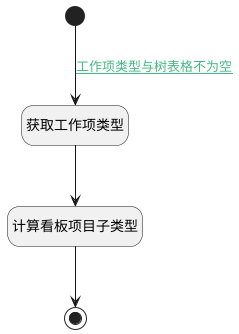

## 计算子工作项类型 <!-- {docsify-ignore-all} -->

   获取项目类型，并根据类型计算当前工作项子类型

### 处理过程




### 处理步骤说明

#### 开始 :id=Begin<sup class="footnote-symbol"> <font color=gray size=1>[开始]</font></sup>


#### 获取工作项类型 :id=PREPAREJSPARAM1<sup class="footnote-symbol"> <font color=gray size=1>[准备参数]</font></sup>


1. 将`Default(传入变量).work_item_type_id` 设置给  `type(工作项类型)`
2. 将`treegrid(树表格).fieldColumns.work_item_type_id.codeListItems` 设置给  `codelistitems(代码表项)`

#### 计算看板项目子类型 :id=RAWJSCODE1<sup class="footnote-symbol"> <font color=gray size=1>[直接前台代码]</font></sup>


<p class="panel-title"><b>执行代码</b></p>

```javascript
const type = uiLogic.type || '';
const codelistItem = uiLogic.codelistitems.find(x => x.id === type);

if (codelistItem && codelistItem.data) {
    uiLogic.children_type = codelistItem.data;
    uiLogic.default.srfUserData = {
        pickerData: uiLogic.children_type,
        codelistTag: 'plmweb.projmgmt__work_item_type',
        pickerField: 'work_item_type_id',
        defaultValue: uiLogic.children_type.split(',')[0]
    };
}

```

#### 结束 :id=END1<sup class="footnote-symbol"> <font color=gray size=1>[结束]</font></sup>


### 连接条件说明
#### 工作项类型与树表格不为空 :id=Begin-PREPAREJSPARAM1

```Default(传入变量).work_item_type_id``` ISNOTNULL AND ```treegrid(树表格)``` ISNOTNULL


### 实体逻辑参数

|    中文名   |    代码名    |  数据类型      |备注 |
| --------| --------| --------  | --------   |
|树表格|treegrid|部件对象||
|子工作项类型|children_type|数据对象||
|项目类型|project_type|数据对象||
|代码表项|codelistitems|数据对象||
|用户自定义参数|srfUserData|数据对象||
|工作项类型|type|数据对象||
|新建默认数据对象|srfDefaultData|数据对象||
|传入变量(<i class="fa fa-check"/></i>)|Default|数据对象||
