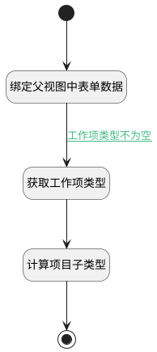

## 计算子工作项类型(上下文) <!-- {docsify-ignore-all} -->

   根据工作项类型，判断此工作项可变更的父工作项/子工作项类型

### 处理过程




### 处理步骤说明

#### 开始 :id=Begin<sup class="footnote-symbol"> <font color=gray size=1>[开始]</font></sup>


#### 绑定父视图中表单数据 :id=PREPAREJSPARAM3<sup class="footnote-symbol"> <font color=gray size=1>[准备参数]</font></sup>


1. 将`view.parentView.layoutPanel.panelItems.form.control.data` 设置给  `parentview_form_data(父视图表单数据)`

#### 获取工作项类型 :id=PREPAREJSPARAM1<sup class="footnote-symbol"> <font color=gray size=1>[准备参数]</font></sup>


1. 将`parentview_form_data(父视图表单数据).work_item_type_id` 设置给  `type(工作项类型)`

#### 计算项目子类型 :id=RAWJSCODE1<sup class="footnote-symbol"> <font color=gray size=1>[直接前台代码]</font></sup>


<p class="panel-title"><b>执行代码</b></p>

```javascript
(async function() {
    const app2 = ibiz.hub.getApp(context.srfappid);
    const dataItems = await app2.codeList.get("plmweb.projmgmt__work_item_type", context, params);
    const type = uiLogic.type || '';
    const codelistItem = dataItems.find(x => x.id === type);
    
    if (codelistItem && codelistItem.data) {
        uiLogic.children_type = codelistItem.data;
        params.n_work_item_type_id_in = codelistItem.data;
    }
})();
```

#### 结束 :id=END2<sup class="footnote-symbol"> <font color=gray size=1>[结束]</font></sup>


### 连接条件说明
#### 工作项类型不为空 :id=PREPAREJSPARAM3-PREPAREJSPARAM1

```parentview_form_data(父视图表单数据).work_item_type_id``` ISNOTNULL


### 实体逻辑参数

|    中文名   |    代码名    |  数据类型      |备注 |
| --------| --------| --------  | --------   |
|上下文|context|导航视图参数绑定参数||
|传入变量(<i class="fa fa-check"/></i>)|Default|数据对象||
|子工作项类型|children_type|数据对象||
|工作项类型|type|数据对象||
|视图参数|params|||
|父视图表单数据|parentview_form_data|数据对象||
|view|view|当前视图对象||
