## 计算选择版本（表格） <!-- {docsify-ignore-all} -->

   基线规划工作项时，版本选择列

### 处理过程

```plantuml
@startuml
hide footbox
<style>
root {
  HyperlinkColor #42b983
}
</style>

hide empty description
state "开始" as Begin <<start>> [[$./calc_choose_version_grid#begin {开始}]]
state "结束" as END1 <<end>> [[$./calc_choose_version_grid#end1 {结束}]]
state "计算表格items" as RAWJSCODE1  [[$./calc_choose_version_grid#rawjscode1 {计算表格items}]]


Begin --> RAWJSCODE1
RAWJSCODE1 --> END1


@enduml
```




### 处理步骤说明

#### 开始 :id=Begin<sup class="footnote-symbol"> <font color=gray size=1>[开始]</font></sup>


#### 结束 :id=END1<sup class="footnote-symbol"> <font color=gray size=1>[结束]</font></sup>


#### 计算表格items :id=RAWJSCODE1<sup class="footnote-symbol"> <font color=gray size=1>[直接前台代码]</font></sup>


<p class="panel-title"><b>执行代码</b></p>

```javascript
const { grid } = uiLogic;
if (grid) {
    grid.state.items.map((item) => {
        item.choose_version_id = item.cur_version_id;
        item.choose_version_name = item.cur_version_name;
    })
    grid.state.rows.forEach((row) => {
        row.data.choose_version_id = row.data.cur_version_id;
        row.data.choose_version_name = row.data.cur_version_name;
    })
}
```


### 实体逻辑参数

|    中文名   |    代码名    |  数据类型      |备注 |
| --------| --------| --------  | --------   |
|表格|grid|当前部件对象||
|传入变量(<i class="fa fa-check"/></i>)|Default|数据对象||
