## 计算父工作项类型 <!-- {docsify-ignore-all} -->

   获取当前工作项类型，并计算父工作项类型

### 处理过程

```plantuml
@startuml
hide footbox
<style>
root {
  HyperlinkColor #42b983
}
</style>

hide empty description
state "开始" as Begin <<start>> [[$./calc_parent_work_item_type#begin {开始}]]
state "计算项目父类型" as RAWJSCODE4  [[$./calc_parent_work_item_type#rawjscode4 {计算项目父类型}]]
state "获取工作项类型" as PREPAREJSPARAM3  [[$./calc_parent_work_item_type#preparejsparam3 {获取工作项类型}]]
state "结束" as END2 <<end>> [[$./calc_parent_work_item_type#end2 {结束}]]


Begin --> PREPAREJSPARAM3 : [[$./calc_parent_work_item_type#begin-preparejsparam3{工作项类型不为空} 工作项类型不为空]]
PREPAREJSPARAM3 --> RAWJSCODE4
RAWJSCODE4 --> END2


@enduml
```




### 处理步骤说明

#### 开始 :id=Begin<sup class="footnote-symbol"> <font color=gray size=1>[开始]</font></sup>


#### 获取工作项类型 :id=PREPAREJSPARAM3<sup class="footnote-symbol"> <font color=gray size=1>[准备参数]</font></sup>


1. 将`params(视图参数).work_item_type_id` 设置给  `type(工作项类型)`

#### 计算项目父类型 :id=RAWJSCODE4<sup class="footnote-symbol"> <font color=gray size=1>[直接前台代码]</font></sup>


<p class="panel-title"><b>执行代码</b></p>

```javascript
(async function() {
    const app2 = ibiz.hub.getApp(context.srfappid);
    const dataItems = await app2.codeList.get("plmweb.projmgmt__work_item_type", context, params);
    const type = uiLogic.type || '';
    const parentItems = dataItems.filter(x => x.data && x.data.includes(type));
    if (parentItems.length > 0) {
        uiLogic.parent_type = parentItems.map(x => x.value).join(',');
        uiLogic.grid.params.n_work_item_type_id_in = uiLogic.parent_type;
    }
})();
```

#### 结束 :id=END2<sup class="footnote-symbol"> <font color=gray size=1>[结束]</font></sup>


### 连接条件说明
#### 工作项类型不为空 :id=Begin-PREPAREJSPARAM3

```params(视图参数).work_item_type_id``` ISNOTNULL


### 实体逻辑参数

|    中文名   |    代码名    |  数据类型      |备注 |
| --------| --------| --------  | --------   |
|工作项类型|type|数据对象||
|视图参数|params|||
|传入变量(<i class="fa fa-check"/></i>)|Default|数据对象||
|表格|grid|部件对象||
|父工作项类型|parent_type|数据对象||
|视图|view|当前视图对象||
