## 计算表格列行为状态(需求树表格) <!-- {docsify-ignore-all} -->

   用于动态控制归档和激活行为的禁用状态

### 处理过程

```plantuml
@startuml
hide footbox
<style>
root {
  HyperlinkColor #42b983
}
</style>

hide empty description
state "开始" as Begin <<start>> [[$./calc_requirement_column_action#begin {开始}]]
state "动态显示界面行为" as RAWJSCODE1  [[$./calc_requirement_column_action#rawjscode1 {动态显示界面行为}]]
state "结束" as END1 <<end>> [[$./calc_requirement_column_action#end1 {结束}]]


Begin --> RAWJSCODE1
RAWJSCODE1 --> END1


@enduml
```




### 处理步骤说明

#### 开始 :id=Begin<sup class="footnote-symbol"> <font color=gray size=1>[开始]</font></sup>


#### 动态显示界面行为 :id=RAWJSCODE1<sup class="footnote-symbol"> <font color=gray size=1>[直接前台代码]</font></sup>


<p class="panel-title"><b>执行代码</b></p>

```javascript
(async function() { 
    const rows = uiLogic.grid.state.rows;
    const app2 = ibiz.hub.getApp(context.srfappid);
    const dataItems = await app2.codeList.get("plmweb.projmgmt__work_item_type", context, params);
	if (rows && rows.length > 0) {
		rows.forEach(row => {
			const titleColumn = row.uiActionGroupStates.title;
			const is_archived = row.data.is_archived;
            const type = row.data.work_item_type_id;
            const codelistItem = dataItems.find(x => x.id === type);
            const parentItems = dataItems.filter(x => x.data && x.data.includes(type));
			if (titleColumn && Object.values(titleColumn).length > 0) {
				Object.values(titleColumn).forEach(action => {
					// 归档
					if (action.uiActionId === 'archive@work_item') {
						action.disabled = is_archived !== 0;
					} else if (action.uiActionId === 'activate@work_item') {
						// 激活
						action.disabled = is_archived === 0;
					} else if (action.uiActionId === 'newrow_test@work_item') {
                        // 新建行
                        action.visible = !!codelistItem.data;
                        // 需求树表格上 用户故事不显示新建行
                        if(type == 'scrum_story'){
						    action.visible = false;
                        }
					} else if (action.uiActionId === 'change_parent@work_item') {
						// 变更父工作项
						action.visible = parentItems.length > 0;
					}
				})
			}
		})
	}
} )();
```

#### 结束 :id=END1<sup class="footnote-symbol"> <font color=gray size=1>[结束]</font></sup>


### 实体逻辑参数

|    中文名   |    代码名    |  数据类型      |备注 |
| --------| --------| --------  | --------   |
|表格|Grid|当前部件对象||
|传入变量(<i class="fa fa-check"/></i>)|Default|数据对象||
