## 计算资源成员（全局） <!-- {docsify-ignore-all} -->

   计算资源甘特部件当前人员，打开选择视图时回显simplelist

### 处理过程

```plantuml
@startuml
hide footbox
<style>
root {
  HyperlinkColor #42b983
}
</style>

hide empty description
state "开始" as Begin <<start>> [[$./calc_resouce_member#begin {开始}]]
state "打开成员选择视图" as DEUIACTION1  [[$./calc_resouce_member#deuiaction1 {打开成员选择视图}]]
state "设置选中数据" as RAWJSCODE1  [[$./calc_resouce_member#rawjscode1 {设置选中数据}]]
state "结束" as END1 <<end>> [[$./calc_resouce_member#end1 {结束}]]


Begin --> RAWJSCODE1
RAWJSCODE1 --> DEUIACTION1
DEUIACTION1 --> END1


@enduml
```




### 处理步骤说明

#### 开始 :id=Begin<sup class="footnote-symbol"> <font color=gray size=1>[开始]</font></sup>


#### 结束 :id=END1<sup class="footnote-symbol"> <font color=gray size=1>[结束]</font></sup>


#### 设置选中数据 :id=RAWJSCODE1<sup class="footnote-symbol"> <font color=gray size=1>[直接前台代码]</font></sup>


<p class="panel-title"><b>执行代码</b></p>

```javascript
const { gantt } = uiLogic;
if (gantt) {
    const selecteddata = JSON.stringify(gantt.getNodeDataByNodeId('member_node'));
    if (selecteddata) {
        params.selecteddata = selecteddata;
    }
}
```

#### 打开成员选择视图 :id=DEUIACTION1<sup class="footnote-symbol"> <font color=gray size=1>[实体界面行为调用]</font></sup>


调用实体 [工作项(WORK_ITEM)](module/ProjMgmt/work_item.md) 界面行为 [全局资源成员设置](module/ProjMgmt/work_item#界面行为) ，行为参数为`Default(传入变量)`


### 实体逻辑参数

|    中文名   |    代码名    |  数据类型      |备注 |
| --------| --------| --------  | --------   |
|选中数据|selectdata|数据对象||
|传入变量(<i class="fa fa-check"/></i>)|Default|数据对象||
|部件|gantt|部件对象||
