## 切换树模式 <!-- {docsify-ignore-all} -->

   切换树模式

### 处理过程

```plantuml
@startuml
hide footbox
<style>
root {
  HyperlinkColor #42b983
}
</style>

hide empty description
state "开始" as Begin <<start>> [[$./change_tree_mode#begin {开始}]]
state "切换显示模式" as VIEWCTRLINVOKE1  [[$./change_tree_mode#viewctrlinvoke1 {切换显示模式}]]
state "准备参数" as PREPAREJSPARAM1  [[$./change_tree_mode#preparejsparam1 {准备参数}]]


Begin --> PREPAREJSPARAM1
PREPAREJSPARAM1 --> VIEWCTRLINVOKE1


@enduml
```

### 处理步骤说明

#### 开始 :id=Begin [开始]

#### 准备参数 :id=PREPAREJSPARAM1 [准备参数]

1. 将`tree` 设置给  `op_params(操作参数).showMode`
2. 将`true` 设置给  `load_params(加载参数).isInitialLoad`

#### 切换显示模式 :id=VIEWCTRLINVOKE1 [视图部件调用]

调用`treegrid(树表部件)`的方法`switchShowMode`，参数为`op_params(操作参数)`

### 实体逻辑参数

|    中文名   |    代码名    |  数据类型      |备注 |
| --------| --------| --------  | --------   |
|传入变量(<i class="fa fa-check"/></i>)|Default|数据对象||
|操作参数|op_params|数据对象||
|树表部件|treegrid|部件对象||
|加载参数|load_params|数据对象||
