## 图表显示总数 <!-- {docsify-ignore-all} -->

   仪表盘图表显示总数


### 处理过程

```plantuml
@startuml
hide footbox
<style>
root {
  HyperlinkColor #42b983
}
</style>

hide empty description
state "开始" as Begin <<start>> [[$./chart_show_count#begin {开始}]]
state "注入脚本代码" as RAWJSCODE1  [[$./chart_show_count#rawjscode1 {注入脚本代码}]]
state "准备参数" as PREPAREJSPARAM1  [[$./chart_show_count#preparejsparam1 {准备参数}]]


Begin --> PREPAREJSPARAM1
PREPAREJSPARAM1 --> RAWJSCODE1


@enduml
```




### 处理步骤说明

#### 开始 :id=Begin<sup class="footnote-symbol"> <font color=gray size=1>[开始]</font></sup>


#### 准备参数 :id=PREPAREJSPARAM1<sup class="footnote-symbol"> <font color=gray size=1>[准备参数]</font></sup>


1. 将`chart(图表)` 设置给  `chart(图表)`

#### 注入脚本代码 :id=RAWJSCODE1<sup class="footnote-symbol"> <font color=gray size=1>[直接前台代码]</font></sup>


<p class="panel-title"><b>执行代码</b></p>

```javascript
const { chart } = uiLogic;
if (chart) {
  const { options } = chart;
  const count = chart.state.items.length || 0;
  const text = '总数：' + count;
  Object.assign(options.title, { text, show: true });
  chart.updateChart();
}
```


### 实体逻辑参数

|    中文名   |    代码名    |  数据类型      |备注 |
| --------| --------| --------  | --------   |
|传入变量(<i class="fa fa-check"/></i>)|Default|数据对象||
|图表|chart|当前部件对象||
