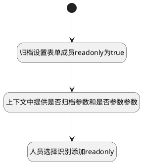

## 控制表单成功关注列表readonly <!-- {docsify-ignore-all} -->

   通过识别上下文中的归档属性，判断工作项表单中关注列表的操作能力

### 处理过程




### 处理步骤说明

#### 开始 :id=Begin<sup class="footnote-symbol"> <font color=gray size=1>[开始]</font></sup>


#### 归档设置表单成员readonly为true :id=RAWJSCODE1<sup class="footnote-symbol"> <font color=gray size=1>[直接前台代码]</font></sup>


<p class="panel-title"><b>执行代码</b></p>

```javascript
if(uiLogic.form.data){
    if(uiLogic.form.data.is_archived === 1 || uiLogic.form.data.is_deleted ===1) {
          uiLogic.form.formItems.forEach(item=>{
              item.state.readonly = true;
          })
    }
}
```

#### 上下文中提供是否归档参数和是否参数参数 :id=RAWJSCODE2<sup class="footnote-symbol"> <font color=gray size=1>[直接前台代码]</font></sup>


<p class="panel-title"><b>执行代码</b></p>

```javascript
if(uiLogic.form.data){
    if(uiLogic.form.data.is_archived === 1) {
         view.context.is_archived = true;
    }
    if(uiLogic.form.data.is_deleted ===1){
        view.context.is_deleted = true;
    }
}
```

#### 人员选择识别添加readonly :id=RAWJSCODE3<sup class="footnote-symbol"> <font color=gray size=1>[直接前台代码]</font></sup>


<p class="panel-title"><b>执行代码</b></p>

```javascript
if(uiLogic.form.data){
    if(uiLogic.form.data.is_archived === 1) {
         view.layoutPanel.panelItems['container_attention'].panelItems.attentions.state.readonly = true;
    }
    if(uiLogic.form.data.is_deleted ===1){
        view.layoutPanel.panelItems['container_attention'].panelItems.attentions.state.readonly = true;
    }
}
```


### 实体逻辑参数

|    中文名   |    代码名    |  数据类型      |备注 |
| --------| --------| --------  | --------   |
|传入变量(<i class="fa fa-check"/></i>)|Default|数据对象||
|应用上下文|context|导航视图参数绑定参数||
|表单对象|form|部件对象||
