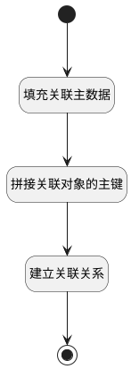

## 建立关联数据 <!-- {docsify-ignore-all} -->

   新建执行后触发，建立关联数据

### 处理过程




### 处理步骤说明

#### 开始 :id=Begin<sup class="footnote-symbol"> <font color=gray size=1>[开始]</font></sup>


#### 填充关联主数据 :id=PREPAREJSPARAM1<sup class="footnote-symbol"> <font color=gray size=1>[准备参数]</font></sup>


1. 将`ctx.principal_type` 设置给  `relation.principal_type`
2. 将`ctx.principal_id` 设置给  `relation.principal_id`
3. 将`Default(传入变量).id` 设置给  `relation.target_id`
4. 将`ctx.target_type` 设置给  `relation.target_type`

#### 拼接关联对象的主键 :id=RAWJSCODE1<sup class="footnote-symbol"> <font color=gray size=1>[直接前台代码]</font></sup>


<p class="panel-title"><b>执行代码</b></p>

```javascript
let relationobj = uiLogic.relation;
relationobj.id = relationobj.principal_id + "_" + relationobj.target_id;
```

#### 建立关联关系 :id=DEACTION1<sup class="footnote-symbol"> <font color=gray size=1>[实体行为]</font></sup>


调用实体 [关联(RELATION)](module/Base/relation.md) 行为 [Create](module/Base/relation#行为) ，行为参数为`relation`

将执行结果返回给参数`relation`

#### 结束 :id=END1<sup class="footnote-symbol"> <font color=gray size=1>[结束]</font></sup>


### 实体逻辑参数

|    中文名   |    代码名    |  数据类型      |备注 |
| --------| --------| --------  | --------   |
|ctx|ctx|导航视图参数绑定参数||
|relation|relation|数据对象||
|传入变量(<i class="fa fa-check"/></i>)|Default|数据对象||
