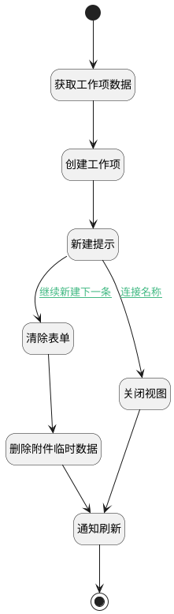

## 自定义确定 <!-- {docsify-ignore-all} -->

   

### 处理过程




### 处理步骤说明

#### 开始 :id=Begin<sup class="footnote-symbol"> <font color=gray size=1>[开始]</font></sup>


#### 获取工作项数据 :id=RAWJSCODE1<sup class="footnote-symbol"> <font color=gray size=1>[直接前台代码]</font></sup>


<p class="panel-title"><b>执行代码</b></p>

```javascript
// uiLogic.work_item = view.layoutPanel.panelItems.form.control.data;
uiLogic.work_item = view.layoutPanel.panelItems.form.control.getReal()[0];
```

#### 创建工作项 :id=DEACTION1<sup class="footnote-symbol"> <font color=gray size=1>[实体行为]</font></sup>


调用实体 [工作项(WORK_ITEM)](module/ProjMgmt/work_item.md) 行为 [Create](module/ProjMgmt/work_item#行为) ，行为参数为`work_item`

将执行结果返回给参数`work_item`

#### 新建提示 :id=RAWJSCODE5<sup class="footnote-symbol"> <font color=gray size=1>[直接前台代码]</font></sup>


<p class="panel-title"><b>执行代码</b></p>

```javascript
ibiz.message.success('新建成功');
```

#### 清除表单 :id=RAWJSCODE3<sup class="footnote-symbol"> <font color=gray size=1>[直接前台代码]</font></sup>

app.deService.clearTempCacheByRs(
    {
        srfappid: context.srfappid,
        srfsessionid: context.srfsessionid,
    },
    'attachment',
);

<p class="panel-title"><b>执行代码</b></p>

```javascript
view.layoutPanel.panelItems.form.control.data.title = null;
view.layoutPanel.panelItems.form.control.data.start_at = null;
view.layoutPanel.panelItems.form.control.data.end_at = null;
view.layoutPanel.panelItems.form.control.data.description = null;
view.layoutPanel.panelItems.form.control.data.backlog_from = null;
view.layoutPanel.panelItems.form.control.data.backlog_type = null;
view.layoutPanel.panelItems.form.control.data.risk = null;
view.layoutPanel.panelItems.form.control.data.reappear_probability = null;
view.layoutPanel.panelItems.form.control.data.severity = null;
view.layoutPanel.panelItems.form.control.data.job_type = null;
view.layoutPanel.panelItems.form.control.data.attachments = null;
view.layoutPanel.panelItems.form.control.details.attachments.mdController.state.items = [];
view.layoutPanel.panelItems.form.control.state.modified = false;
view.layoutPanel.panelItems.form.control.data.html_description = '';
view.layoutPanel.panelItems.form.control.data.md_description = '';
view.layoutPanel.panelItems.form.control.data.excel_description = '';
```

#### 删除附件临时数据 :id=RAWJSCODE6<sup class="footnote-symbol"> <font color=gray size=1>[直接前台代码]</font></sup>


<p class="panel-title"><b>执行代码</b></p>

```javascript
return (async function() { 
    // 获取所有临时数据
    const serviceUtil = ibiz.hub.getApp(context.srfappid).deService;
    const service = await serviceUtil.getService(context, 'plmweb.attachment');
    const list = service.local.getList();
    // 遍历临时数据删除
    list.forEach(item => {
        service.local.delete(context, item.id);
    })
    // 刷新重复器表格
    view.layoutPanel.panelItems.form.control.details.attachments.refresh();
    } 
)();
```

#### 结束 :id=END1<sup class="footnote-symbol"> <font color=gray size=1>[结束]</font></sup>


#### 关闭视图 :id=RAWJSCODE4<sup class="footnote-symbol"> <font color=gray size=1>[直接前台代码]</font></sup>


<p class="panel-title"><b>执行代码</b></p>

```javascript
view.layoutPanel.panelItems.form.control.state.modified = false;
view.state.isLoading = false;
view.closeView();
```

#### 通知刷新 :id=RAWJSCODE2<sup class="footnote-symbol"> <font color=gray size=1>[直接前台代码]</font></sup>


<p class="panel-title"><b>执行代码</b></p>

```javascript
ibiz.mc.command.create.send({ srfdecodename: 'work_item'});
```

### 连接条件说明
#### 继续新建下一条 :id=RAWJSCODE5-RAWJSCODE3

```view(当前视图对象).layoutPanel.panelItems.is_nexted.value``` EQ ```1```
#### 连接名称 :id=RAWJSCODE5-RAWJSCODE4

```view(当前视图对象).layoutPanel.panelItems.is_nexted.value``` NOTEQ ```1```


### 实体逻辑参数

|    中文名   |    代码名    |  数据类型      |备注 |
| --------| --------| --------  | --------   |
|传入变量(<i class="fa fa-check"/></i>)|Default|数据对象||
|work_item|work_item|数据对象||
|当前视图对象|view|当前视图对象||
