## 导出为图片（甘特图） <!-- {docsify-ignore-all} -->

   甘特图导出为图片

### 处理过程

```plantuml
@startuml
hide footbox
<style>
root {
  HyperlinkColor #42b983
}
</style>

hide empty description
state "开始" as Begin <<start>> [[$./export_gantt_image#begin {开始}]]
state "导出图片" as RAWJSCODE1  [[$./export_gantt_image#rawjscode1 {导出图片}]]


Begin --> RAWJSCODE1


@enduml
```




### 处理步骤说明

#### 开始 :id=Begin<sup class="footnote-symbol"> <font color=gray size=1>[开始]</font></sup>


#### 导出图片 :id=RAWJSCODE1<sup class="footnote-symbol"> <font color=gray size=1>[直接前台代码]</font></sup>


<p class="panel-title"><b>执行代码</b></p>

```javascript
const viewDom = document.getElementById(view.id);
const gantt = viewDom.querySelector('.ibiz-control-gantt');
if (gantt) {
    gantt.classList.add('is-exporting');
    await ibiz.util.html2canvas.exportCanvas(gantt, { fileName: view.model.caption });
    gantt.classList.remove('is-exporting');
}
```


### 实体逻辑参数

|    中文名   |    代码名    |  数据类型      |备注 |
| --------| --------| --------  | --------   |
|传入变量(<i class="fa fa-check"/></i>)|Default|数据对象||
