## 导出报表excel <!-- {docsify-ignore-all} -->

   

### 处理过程

```plantuml
@startuml
hide footbox
<style>
root {
  HyperlinkColor #42b983
}
</style>

hide empty description
state "开始" as Begin <<start>> [[$./export_report_excel#begin {开始}]]
state "视图部件调用" as VIEWCTRLINVOKE1  [[$./export_report_excel#viewctrlinvoke1 {视图部件调用}]]


Begin --> VIEWCTRLINVOKE1


@enduml
```

### 处理步骤说明

#### 开始 :id=Begin [开始]

#### 视图部件调用 :id=VIEWCTRLINVOKE1 [视图部件调用]

调用`chart(图表)`的方法`exportExcel`，参数为`Default(传入变量)`

### 实体逻辑参数

|    中文名   |    代码名    |  数据类型      |备注 |
| --------| --------| --------  | --------   |
|图表|chart|部件对象||
|传入变量(<i class="fa fa-check"/></i>)|Default|数据对象||
