## 填充子工作项类型 <!-- {docsify-ignore-all} -->

   子工作项新建默认填充首个子工作项类型

### 处理过程

```plantuml
@startuml
hide footbox
<style>
root {
  HyperlinkColor #42b983
}
</style>

hide empty description
state "开始" as Begin <<start>> [[$./fill_work_item_sub_type#begin {开始}]]
state "结束" as END1 <<end>> [[$./fill_work_item_sub_type#end1 {结束}]]
state "填充表单数据" as RAWJSCODE2  [[$./fill_work_item_sub_type#rawjscode2 {填充表单数据}]]
state "获取工作项类型" as DEACTION1  [[$./fill_work_item_sub_type#deaction1 {获取工作项类型}]]
state "设置上下文" as RAWJSCODE1  [[$./fill_work_item_sub_type#rawjscode1 {设置上下文}]]


Begin --> RAWJSCODE1
RAWJSCODE1 --> DEACTION1
DEACTION1 --> RAWJSCODE2
RAWJSCODE2 --> END1


@enduml
```




### 处理步骤说明

#### 开始 :id=Begin<sup class="footnote-symbol"> <font color=gray size=1>[开始]</font></sup>


#### 结束 :id=END1<sup class="footnote-symbol"> <font color=gray size=1>[结束]</font></sup>


#### 设置上下文 :id=RAWJSCODE1<sup class="footnote-symbol"> <font color=gray size=1>[直接前台代码]</font></sup>


<p class="panel-title"><b>执行代码</b></p>

```javascript
uiLogic.ctx.work_item_type = view.context.work_item_sub_type.split(',')[0];
```

#### 获取工作项类型 :id=DEACTION1<sup class="footnote-symbol"> <font color=gray size=1>[实体行为]</font></sup>


调用实体 [工作项类型(WORK_ITEM_TYPE)](module/ProjMgmt/work_item_type.md) 行为 [Get](module/ProjMgmt/work_item_type#行为) ，行为参数为`ctx(work_item_type)`

将执行结果返回给参数`work_item_type`

#### 填充表单数据 :id=RAWJSCODE2<sup class="footnote-symbol"> <font color=gray size=1>[直接前台代码]</font></sup>


<p class="panel-title"><b>执行代码</b></p>

```javascript
view.layoutPanel.panelItems.form.control.data.work_item_type_id = uiLogic.work_item_type.id;
view.layoutPanel.panelItems.form.control.data.work_item_type_name = uiLogic.work_item_type.name;
```


### 实体逻辑参数

|    中文名   |    代码名    |  数据类型      |备注 |
| --------| --------| --------  | --------   |
|work_item_type|ctx|导航视图参数绑定参数||
|传入变量(<i class="fa fa-check"/></i>)|Default|数据对象||
|work_item_type|work_item_type|数据对象||
