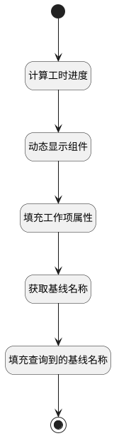

## 获取工作项工时进度 <!-- {docsify-ignore-all} -->

   获取工时信息，并计算工时进度

### 处理过程




### 处理步骤说明

#### 开始 :id=Begin<sup class="footnote-symbol"> <font color=gray size=1>[开始]</font></sup>


#### 计算工时进度 :id=RAWJSCODE1<sup class="footnote-symbol"> <font color=gray size=1>[直接前台代码]</font></sup>


<p class="panel-title"><b>执行代码</b></p>

```javascript
var form_data = view.layoutPanel.panelItems.form.control.data;
var remaining_workload = form_data.remaining_workload;
var actual_workload = form_data.actual_workload;
var estimated_workload = form_data.estimated_workload;  
var estimated = 0; // 预估工时
if(estimated_workload){
	estimated = Number(estimated_workload);
}
var actual = 0; // 之前登记的实际工时
if(actual_workload){
	actual = Number(actual_workload);
}
var remaining = 0;
if(remaining_workload){
	remaining = Number(remaining_workload);
}
// 计算工时进度
if((actual + remaining) != 0){
	var schedule = ((actual / (actual + remaining)) * 100).toFixed(1);
	form_data.workload_schedule = schedule;
}
```

#### 动态显示组件 :id=RAWJSCODE2<sup class="footnote-symbol"> <font color=gray size=1>[直接前台代码]</font></sup>


<p class="panel-title"><b>执行代码</b></p>

```javascript
const form = uiLogic.form.details;
const srfreadonly = context.srfreadonly;
if(srfreadonly === true || srfreadonly === 'true'){
    // 工时按钮
    form.grouppanel1.state.visible=false; 
    // 基线按钮
    form.grouppanel12.state.visible=false;
    // 附件按钮
    form.grouppanel11.state.actionGroupState.uaa6fcf7.visible=false;
}
const _type = uiLogic.form.state.data.work_item_sub_type;
form.tabpanel1_child.state.visible = !!_type;

```

#### 填充工作项属性 :id=PREPAREJSPARAM2<sup class="footnote-symbol"> <font color=gray size=1>[准备参数]</font></sup>


1. 将`Default(传入变量).id` 设置给  `work_item(工作项).id`
2. 将`Default(传入变量).cur_version_id` 设置给  `work_item(工作项).cur_version_id`

#### 获取基线名称 :id=DEACTION1<sup class="footnote-symbol"> <font color=gray size=1>[实体行为]</font></sup>


调用实体 [工作项(WORK_ITEM)](module/ProjMgmt/work_item.md) 行为 [获取基线名称(get_baseline_name)](module/ProjMgmt/work_item#行为) ，行为参数为`work_item(工作项)`

将执行结果返回给参数`work_item(工作项)`

#### 填充查询到的基线名称 :id=PREPAREJSPARAM1<sup class="footnote-symbol"> <font color=gray size=1>[准备参数]</font></sup>


1. 将`work_item(工作项).baseline_name` 设置给  `view(当前视图对象).layoutPanel.panelItems.form.control.data.baseline_name`

#### 结束 :id=END1<sup class="footnote-symbol"> <font color=gray size=1>[结束]</font></sup>


### 实体逻辑参数

|    中文名   |    代码名    |  数据类型      |备注 |
| --------| --------| --------  | --------   |
|工作项|work_item|数据对象||
|当前视图对象|view|当前视图对象||
|传入变量(<i class="fa fa-check"/></i>)|Default|数据对象||
|表单|form|当前部件对象||
