## 我负责的工作项图表跳转（移动端） <!-- {docsify-ignore-all} -->

   

### 处理过程

```plantuml
@startuml
hide footbox
<style>
root {
  HyperlinkColor #42b983
}
</style>

hide empty description
state "开始" as Begin <<start>> [[$./mob_my_assign_chart_jump#begin {开始}]]
state "界面行为" as DEUIACTION3  [[$./mob_my_assign_chart_jump#deuiaction3 {界面行为}]]
state "界面行为" as DEUIACTION2  [[$./mob_my_assign_chart_jump#deuiaction2 {界面行为}]]
state "结束" as END1 <<end>> [[$./mob_my_assign_chart_jump#end1 {结束}]]
state "界面行为" as DEUIACTION4  [[$./mob_my_assign_chart_jump#deuiaction4 {界面行为}]]
state "界面行为" as DEUIACTION1  [[$./mob_my_assign_chart_jump#deuiaction1 {界面行为}]]


Begin --> DEUIACTION1 : [[$./mob_my_assign_chart_jump#begin-deuiaction1{已完成} 已完成]]
DEUIACTION1 --> END1
Begin --> DEUIACTION2 : [[$./mob_my_assign_chart_jump#begin-deuiaction2{未开始} 未开始]]
DEUIACTION2 --> END1
Begin --> DEUIACTION3 : [[$./mob_my_assign_chart_jump#begin-deuiaction3{进行中} 进行中]]
DEUIACTION3 --> END1
Begin --> DEUIACTION4 : [[$./mob_my_assign_chart_jump#begin-deuiaction4{已关闭} 已关闭]]
DEUIACTION4 --> END1


@enduml
```




### 处理步骤说明

#### 界面行为 :id=DEUIACTION1<sup class="footnote-symbol"> <font color=gray size=1>[实体界面行为调用]</font></sup>


调用实体 [工作项(WORK_ITEM)](module/ProjMgmt/work_item.md) 界面行为 [跳转已完成的工作项（移动端）](module/ProjMgmt/work_item#界面行为) ，行为参数为`Default(传入变量)`

#### 界面行为 :id=DEUIACTION2<sup class="footnote-symbol"> <font color=gray size=1>[实体界面行为调用]</font></sup>


调用实体 [工作项(WORK_ITEM)](module/ProjMgmt/work_item.md) 界面行为 [跳转未开始的工作项（移动端）](module/ProjMgmt/work_item#界面行为) ，行为参数为`Default(传入变量)`

#### 开始 :id=Begin<sup class="footnote-symbol"> <font color=gray size=1>[开始]</font></sup>


#### 结束 :id=END1<sup class="footnote-symbol"> <font color=gray size=1>[结束]</font></sup>


#### 界面行为 :id=DEUIACTION3<sup class="footnote-symbol"> <font color=gray size=1>[实体界面行为调用]</font></sup>


调用实体 [工作项(WORK_ITEM)](module/ProjMgmt/work_item.md) 界面行为 [跳转进行中的工作项（移动端）](module/ProjMgmt/work_item#界面行为) ，行为参数为`Default(传入变量)`

#### 界面行为 :id=DEUIACTION4<sup class="footnote-symbol"> <font color=gray size=1>[实体界面行为调用]</font></sup>


调用实体 [工作项(WORK_ITEM)](module/ProjMgmt/work_item.md) 界面行为 [跳转已关闭的工作项（移动端）](module/ProjMgmt/work_item#界面行为) ，行为参数为`Default(传入变量)`

### 连接条件说明
#### 已完成 :id=Begin-DEUIACTION1

```Default(传入变量)._catalog``` EQ ```已完成```
#### 未开始 :id=Begin-DEUIACTION2

```Default(传入变量)._catalog``` EQ ```未开始```
#### 进行中 :id=Begin-DEUIACTION3

```Default(传入变量)._catalog``` EQ ```进行中```
#### 已关闭 :id=Begin-DEUIACTION4

```Default(传入变量)._catalog``` EQ ```已关闭```


### 实体逻辑参数

|    中文名   |    代码名    |  数据类型      |备注 |
| --------| --------| --------  | --------   |
|当前视图|view|当前视图对象||
|传入变量(<i class="fa fa-check"/></i>)|Default|数据对象||
|当前部件|ctrl|当前部件对象||
