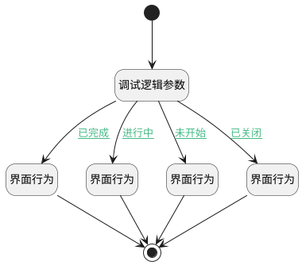

## 我负责的工作项图表跳转 <!-- {docsify-ignore-all} -->

   

### 处理过程




### 处理步骤说明

#### 界面行为 :id=DEUIACTION1<sup class="footnote-symbol"> <font color=gray size=1>[实体界面行为调用]</font></sup>


调用实体 [工作项(WORK_ITEM)](module/ProjMgmt/work_item.md) 界面行为 [跳转已完成的工作项](module/ProjMgmt/work_item#界面行为) ，行为参数为`Default(传入变量)`

#### 界面行为 :id=DEUIACTION2<sup class="footnote-symbol"> <font color=gray size=1>[实体界面行为调用]</font></sup>


调用实体 [工作项(WORK_ITEM)](module/ProjMgmt/work_item.md) 界面行为 [跳转未开始的工作项](module/ProjMgmt/work_item#界面行为) ，行为参数为`Default(传入变量)`

#### 结束 :id=END1<sup class="footnote-symbol"> <font color=gray size=1>[结束]</font></sup>


#### 开始 :id=Begin<sup class="footnote-symbol"> <font color=gray size=1>[开始]</font></sup>


#### 调试逻辑参数 :id=DEBUGPARAM1<sup class="footnote-symbol"> <font color=gray size=1>[调试逻辑参数]</font></sup>


> [!NOTE|label:调试信息|icon:fa fa-bug]
> 调试输出参数`传入变量`的详细信息

#### 界面行为 :id=DEUIACTION3<sup class="footnote-symbol"> <font color=gray size=1>[实体界面行为调用]</font></sup>


调用实体 [工作项(WORK_ITEM)](module/ProjMgmt/work_item.md) 界面行为 [跳转进行中的工作项](module/ProjMgmt/work_item#界面行为) ，行为参数为`Default(传入变量)`

#### 界面行为 :id=DEUIACTION4<sup class="footnote-symbol"> <font color=gray size=1>[实体界面行为调用]</font></sup>


调用实体 [工作项(WORK_ITEM)](module/ProjMgmt/work_item.md) 界面行为 [跳转已关闭的工作项](module/ProjMgmt/work_item#界面行为) ，行为参数为`Default(传入变量)`

### 连接条件说明
#### 已完成 :id=DEBUGPARAM1-DEUIACTION1

```Default(传入变量)._catalog``` EQ ```已完成```
#### 未开始 :id=DEBUGPARAM1-DEUIACTION2

```Default(传入变量)._catalog``` EQ ```未开始```
#### 进行中 :id=DEBUGPARAM1-DEUIACTION3

```Default(传入变量)._catalog``` EQ ```进行中```
#### 已关闭 :id=DEBUGPARAM1-DEUIACTION4

```Default(传入变量)._catalog``` EQ ```已关闭```


### 实体逻辑参数

|    中文名   |    代码名    |  数据类型      |备注 |
| --------| --------| --------  | --------   |
|当前部件|ctrl|当前部件对象||
|当前视图|view|当前视图对象||
|传入变量(<i class="fa fa-check"/></i>)|Default|数据对象||
